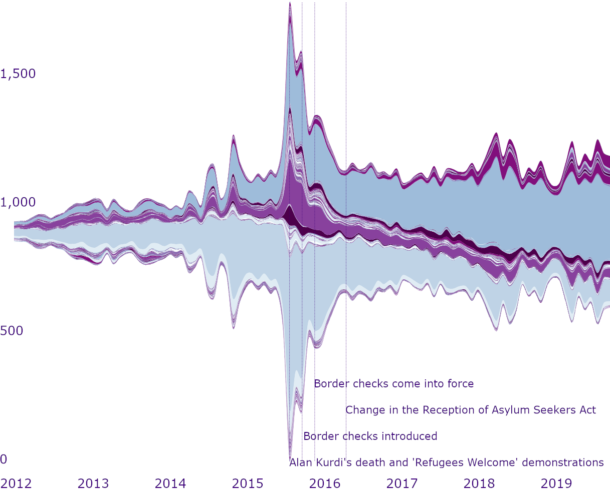

# Supplementary information for 
# Using community evolution tracking and word2vector techniques to analyse polarisation in dynamic discussion networks


This document provides additional information on the data handling, methods and results and complements the main text of the manuscript. The document is compiled as an R script with comments, so, it is easy to understand how the data was transformed, which methods were used and how the results were received. Results that were mentioned in the main manuscript but not elaborated upon in the paper, highlighted in the Supplementary information as blocks of text with images.

Due to ethical concerns, we are not allowed to provide the full dataset of the collected tweets. The IDs of the analysed tweets are provided on demand.

The code follows the parts of the analysis in the logical order.
## Dynamic community detection
The first step in the analysis was to distinguish dynamic communities of users. To do so, we have used a two-fold approach. First, the static networks of each time period (month) were divided into clusters applying multi-level modularity optimization algorithm within the package igraph [@igraph]. After the static clusters were detected, community evolution tracking algorithm was applied to distinguished dynamic communities.
### Static community detection


```r
# The following block of code finds those users posted more than 5 Twitter
# messages in a month and creates a new object nodes_active_unique, 
# which is a list, each object in which is a list of active users in a 
# given month

# Loading the dataset
load("twitter_df.RData")

# Loading the neaded packages for data transformations
#install.packages(c("tidyr","dplyr"),dependencies = T)
library(tidyr)
library(dplyr)

# Creating a new variable that identifies the month when the tweet was posted
data$month <- format.Date(as.Date(data$created_at),"%Y-%m")

# Identifying users who posted more than 5 messages in a given month
nodes_active <- data %>%
  select (user_id, text, month)%>% # Selecting only the needed columns
  group_by (user_id)%>% # Group_by the user
  group_by (month, .add = T)%>% # Group_by the month when the tweet was posted
  summarise (n= n())%>% # Counting the number of tweets
  filter (n >5)%>% # Keeping only those that are more than 5
  as.data.frame() # saving as a df

# Subsetting the df, keeping only active users
data<-data[which(data$user_id %in% nodes_active$user_id),]

# Creating a new object that will store the months and their numbers
time <- 1:96 # Months' numbers
names(time) <- sort(unique(nodes_active$month)) # Months themselves

#identify unique active users in each time slot
nodes_active_unique <- vector (mode = "list", length = 96)

# Saving active users into a new object, list nodes_active_unique, 
# where each object in a list is a list of active users
for (i in seq_along(time)) # for all time periods, save active users
{
  nodes_active_unique [[i]] <- nodes_active$user_id[nodes_active$month == names(time [i])]
}  
```


```r
# The following block of code creates edge lists for each time period

# Creating empty edge lists
active_edgelists <- vector (mode = "list", length = 96) # here, length
# equals the number of the time periods

# Filling the object for each time period
for (i in seq_along(time))
{
  active_edgelists [[i]] <- data [(data$user_id %in% nodes_active_unique [[i]] ==T)&(data$month == names(time [i])),] # selecting active nodes in a given month
  active_edgelists [[i]]<-active_edgelists [[i]] %>% # creating an edge list with mentions and replies
    select  (user_id, reply_to_user_id, mentions_user_id)%>%
    unnest (mentions_user_id)%>%
    pivot_longer (names_to = "type", values_to = "alter", cols = 2:3)%>%
    select  (-type)%>%
    filter(!is.na(alter)) %>% # removing isolates
    filter(user_id != alter) %>% # removing self-loops
    filter(alter %in% nodes_active_unique [[i]] == T) %>%
    distinct () %>% # removing duplicated ties
    as.data.frame() # saving as a df
}
```


```r
# The following block of code creates static networks for each time period

# Loading the package igraph
#install.packages("igraph", dependencies = T)
library(igraph)

# Creating an empty object
temp_graphs_active <-  vector (mode = "list", length = 96)

# Transforming edge lists to the networks
for (i in 1:length(active_edgelists))
{
  temp_graphs_active[[i]]<- graph_from_data_frame(active_edgelists [[i]], directed = T) 
}

# Creating a new object for undirected networks
# We need undirected network to cluster them later
temp_graphs_und_active <-  vector (mode = "list", length = 96)
for (i in 1:length(temp_graphs_active))
{
  temp_graphs_und_active[[i]]<- as.undirected(temp_graphs_active [[i]]) 
}
```


```r
# The next block of code shows how to find communities in the static networks

# Creating two empty objects
temp_cl_active <- vector (mode = "list", length = 96)
temp_memb_active <- vector (mode = "list", length = 96)

# Applying multi-level modularity optimization algorithm to find communities
for (i in 1:length(temp_graphs_und_active))
{
  temp_cl_active[[i]]<- cluster_louvain(temp_graphs_und_active [[i]]) 
  temp_memb_active[[i]]<-membership(temp_cl_active [[i]])
}

# Checking modularity values
mod_active <- vector ()
for (i in 1:length(temp_cl_active))
{
  mod_active [i]<- modularity(temp_cl_active[[i]])
}
```


```r
# The following code shows how to see modularity values 
mod<-as.data.frame(mod_active,names(time))
mod$date<-paste0(rownames(mod),"-01")
mod$date<-as.Date(mod$date,format="%Y-%m-%d")

#install.packages("clplot")
my_colors = c("#FFF5EB","#FEE6CE","#FDD0A2","#FDAE6B","#FD8D3C","#F16913","#D94801","#A63603","#7F2704")
clplot(x=decimal_date(mod$date), y=mod$mod_active, lwd=3, levels=c(0.33,0.36,0.39,0.42,0.45,0.48,0.51,0.54), col=my_colors, showcuts=T , bty="n",xlab="",ylab = "modularity")
```

The modularity values change over time as follows:

<div class="figure">

<p class="caption">Fig. 1. Modularity changes over time</p>
</div>


```r
#The following block of code saves found static clusters into a df

# Creating a summary data frame with users' community membership 
# information across all time periods
unique_users <- vector ("list", 96)

# Extracting unique users from each static network 
for (i in 1:length(temp_graphs_active))
{
  unique_users[[i]]<-V(temp_graphs_active[[i]])$name
}  
unique_users<- unique(unlist(unique_users))

# Creating the data frame
memb_df <- data.frame (user_id = unique_users)
memb_df[,2:97] <- NA
colnames (memb_df)<-c("user_id", 1:96) #remaning column names
rownames (memb_df) <- memb_df$user_id
memb_df$user_id <- NULL

# Populating the data frame with the values from membership list
  for (j in 1:length(temp_memb_active))
  {
    for (k in 1:length(temp_memb_active[[j]]))
    {
    memb_df [names(temp_memb_active[[j]][k]), j] <-  temp_memb_active[[j]][k] 
    }
  }
```


### Community evolution tracking


```r
# Users and their static clusters were saved in the df 

# The following block of code saves users and their clusters for each time
# period as a list of dataframes
# each object in a list is a df for the specific time periods

# Creating a column user_id in the df with static clusters
memb_df$user_id<-rownames(memb_df)

# function for splitting the df into the list of lists each object in 
# the list contains names of users that are in the same cluster
split_tibble <- function(tibble, column = 'col') {
  tibble %>% split(., .[,column]) %>% lapply(., function(x) x[,setdiff(names(x),column)])
}

#creating an empty list
memb<-list()

# for-loop to create the list that contains clusters
# each element is a month
for (i in 1:(length(names(memb_df))-1)){
  j<-as.character(i)
  memb[[i]] <- split_tibble(memb_df[,c("user_id",i)], j) # the df is 2 
                             # column: user_id and the month number
  # j is the name of the column
  print(i)} # tracking the progress
```


```r
# The next block of code tracks the community evolution over time

# First, we need to copy the first object in the list of static clusters
# Here, we copy only the clusters of the first time period
memb2<-memb[[1]]

# Changing the names of the clusters to the form "N of the period_N of cluster"

# In that way, we can also track when is the moment when the cluster 
# reaches its peak in size
names(memb2)<-paste0(1,"_",names(memb2)) # for period 1, the names are 1_(1/2/3...)

# Creating a new object that will store temporary information needed later
p<-data.frame(Cluster=character(), # the number of the current cluster
              Number_of_elements=numeric(), # the number of the elements
              all_elements=numeric(), # the number of the elements
              cl_num=numeric(), # the number of the cluster
              stringsAsFactors=FALSE)

# Writing a for-loop to track the evolution of the clusters
for (i in 2:length(memb)){ # Starting from the second time period in the list memb
                           # The first one is already in a new list of objects
                           # memb2
  
  for (j in 1:length(memb[[i]])){ # For each static cluster within the current time
                                  # period 
    
    
    p<-p[0,] # Deleting previous information from the temporary df
    cat("element ", j, " in the period ",i,"\n") # the number of the static cluster
                                                 # within the time period
    
    # The next for-loop tracks how many of the users in the current static cluster 
    # also existed before 
    # It tracks in which distinguished dynamic clusters those users appeared,
    # Calculates the number of users in the static cluster, which appeared 
    # in the clusters of the previous time periods
    
    for (k in 1:length(memb2)){ # Check for every dynamic cluster in the list memb2
                                # Those dynamic clusters that we found before
      cat("k = ", k, "\n") # Tracking the progress
      if (sum(memb[[i]][[j]] %in% memb2[[k]])>=1){ # If any of the users 
        # in the current static cluster were in any of the clusters
        # of the previous time periods
        
        a<-c(names(memb2)[k], # save the name of the dynamic cluster
             sum(memb[[i]][[j]] %in% memb2[[k]]), # save the number of users
             # that appear in the dynamic cluster
             length(memb[[i]][[j]]), #save the length of the current cluster 
             k)# save the number of the dynamic cluster

        p[(nrow(p)+1),]<-a # add this information to the temporary df
      } 
    }
    
    # After the number of users that match users, which appeared in the 
    # previous time periods, was calculated and we tracked in which 
    # dynamic clusters users of the current cluster appeared before,
    # we need to do the following
    
    if (nrow(p)>1){ # If we found at least one matching user
      
      if (max(p$Number_of_elements)<length(memb[[i]][[j]])/2){ # if the max
        # number of static cluster users that appeared in the dynamic clusters
        # before is less than half the number of the static cluster users, then

        if (max(p$Number_of_elements)>=3 & #if it is at least more than 3
            (nrow(p[p$Number_of_elements==max(p$Number_of_elements),])==1)){ 
          # if the max number of matching users appears only in one of the 
          # dynamic clusters
          memb2[[as.numeric(p$cl_num[which.max(p$Number_of_elements)])]]<-
            unique(append(memb2[[as.numeric(p$cl_num[which.max(p$Number_of_elements)])]],memb[[i]][[j]]))
          # then, add all users of the static cluster to the elements 
          # of that dynamic cluster
          
          # the next for-loop will delete all the elements that were assigned
          # to the dynamic cluster from other dynamic clusters, if which
          # they appeared before
          # In that way, the elements would not appear in several dynamic clusters
          for (l in 1:nrow(p)){
            memb2[[as.numeric(p$cl_num[l])]]<-unlist(memb2[[as.numeric(p$cl_num[l])]])[which(!memb2[[as.numeric(p$cl_num[l])]] %in% memb[[i]][[j]])]}
          cat("p > 1. Number of elements less than ",length(memb[[i]][[j]])/2,"but more than 2\n") 
          # for tracking the progress
          
        } else { #if the maximum number of matching elements is less than 3,
          # then we need to create a new dynamic cluster
          
          
          memb2<-append(memb2,list(memb[[i]][[j]])) # appending to the list
          # of dynamic clusters
          names(memb2)[length(memb2)]<-paste0(i,"_",j) # assigning a new name
          # specifying the number of the time period
          
          # Here, once again we delete the matched users from other dynamic clusters
          for (l in 1:nrow(p)){
            memb2[[as.numeric(p$cl_num[l])]]<-unlist(memb2[[as.numeric(p$cl_num[l])]])[which(!memb2[[as.numeric(p$cl_num[l])]] %in% memb[[i]][[j]])]}
          cat("p > 1. Number of elements less than 3\n")
        }
        
        
          
      } else { # If the number of matched users is more than half of the users
        # in the static cluster, 
        
        # then all the users of the static cluster, belong to this dynamic cluster
        memb2[[as.numeric(p$cl_num[which.max(p$Number_of_elements)])]]<-
          unique(append(memb2[[as.numeric(p$cl_num[which.max(p$Number_of_elements)])]],memb[[i]][[j]]))
        
        # Retrieving the users of the static cluster from other dynamic clusters
        for (l in 1:nrow(p)){
          memb2[[as.numeric(p$cl_num[l])]]<-unlist(memb2[[as.numeric(p$cl_num[l])]])[which(!memb2[[as.numeric(p$cl_num[l])]] %in% memb[[i]][[j]])]}
        cat("p > 1. Number of elements more than ",length(memb[[i]][[j]])/2,"\n")
      }
      
      
      
    } else if(nrow(p)>0){ # If the elements match only one dynamic cluster
      
      
      if (max(p$Number_of_elements)<length(memb[[i]][[j]])/2){
        # if the max number of static cluster users that appeared in the dynamic cluster
        # before is less than half the number of the static cluster users, then
        
        # Add it as a new dynamic cluster
        memb2<-append(memb2,list(memb[[i]][[j]]))
        names(memb2)[length(memb2)]<-paste0(i,"_",j) # Assign the name to the cluster
        
        # Retrieve the users from other dynamic clusters
          memb2[[as.numeric(p$cl_num[1])]]<-unlist(memb2[[as.numeric(p$cl_num[1])]])[which(!memb2[[as.numeric(p$cl_num[1])]] %in% memb[[i]][[j]])]
          cat("p = 1. Number of elements less than ",length(memb[[i]][[j]])/2,"\n")
     
          
       } else {# if the max number of static cluster users that appeared in the dynamic cluster
        # before is more or equal to half the number of the static cluster users, then
        
        # Assign those users to the distinguished dynamic cluster
        memb2[[as.numeric(p$cl_num[which.max(p$Number_of_elements)])]]<-
          unique(append(memb2[[as.numeric(p$cl_num[which.max(p$Number_of_elements)])]],memb[[i]][[j]]))
        
        cat("p = 1. Number of elements more than ",length(memb[[i]][[j]])/2,"\n")
       }
      
      
    }else { # Otherwise, there are no matches 
      
      memb2<-append(memb2,list(memb[[i]][[j]])) # Create a new cluster
      names(memb2)[length(memb2)]<-paste0(i,"_",j) # Assign a name 
      cat("No similar elements\n")
    }
    
    j<-j+1
    
  }
}

# Next, we need to convert list into a df

#install.packages("plyr",dependencies=T)
library (plyr) # to convert list into a df

memb_df <- ldply (memb2, data.frame) # Converting

# Saving as a df with one column as a list of users
# and other - as a list of dynamic clusters
memb_df <- memb_df [,c(2,1)]
names(memb_df)<-c("user_id","dyn_cluster") # renaming the columns


# Merge the results with the main dataframe

data<-left_join(data,memb_df)
# Now, we have a new column dyn_cluster
```

## Sentiment analysis

After acquiring the information about the placement of users in the dynamic clusters, we have conducted sentiment analysis. To do so, we did the following.

1. Cleaned the text removing non-informative words, symbols and numbers;
2. Used part-of-speech tagging to keep only nouns, adjectives and verbs;
3. Applied word embedding dictionary to receive coordinates of the tweets in the 100-dimensional space;
4. Applied k-means clustering to cluster tweets by topics;
5. Applied sentiment dictionary to compute the mean sentiment of each tweet;
6. Scaled the sentiment values of each tweet depending on the k-means cluster, found on step 4;
7. Divided the tweets into positive, neutral and negative in sentiment tweets
8. Conducted a robustness check to see if the tweets fit the sentiment groups

### Cleaning up the texts of the tweets


```r
# The following block of code shows how the texts of the tweets were reprocessed

# First, loading the required packages 
#install.packages(c("tm","tidyverse","stopwords","quanteda","textclean"))
library(tm)
library (tidyverse) 
library (stopwords)
library (quanteda)
library (textclean)

# Adding one more column to identify tweets
data$doc_id<-1:length(data$text)

# Cleaning up the texts
tweet_text <- data$text %>%
  gsub("[^[:alnum:][:blank:][:punct:]]", " ", .) %>% # removing special chars
  gsub("[ |\t]{2,}", " ", .)%>% # tabs
  gsub("http\\S+", " ", .)%>% # removing https
  gsub ("www\\S+", " ", .)%>%#removing www
  gsub ("&\\S+", " ", .)%>%
  gsub("@\\S+", " ", .)%>% # mentions
  gsub('\\p{So}|\\p{Cn}', '', ., perl = TRUE)%>% # removing emojis
  replace_html (., symbol = F) %>% # removing html markup
  replace_kern () %>% #K E R N
  gsub("\\.(?=[A-Za-z])","\\. ", .,perl=TRUE)%>% # inserting a white space after full stop
  str_trim ()%>% # trailing whitespaces
  str_squish()%>% # whitespaces at the beginning and the end of the sentence
  gsub(" [ a-zA-ZäÄöÖåÅ ] ","", .)#deleting all one character words
data$new_text<-tweet_text

# Removing duplicated and short entries
data <- data [duplicated (data$text) == F,] # removing duplicated strings
data<- data [str_count(as.character(data$new_text), '\\w+')>3,]# removing strings with less than three words


# Specifying customary stop words
twitter_stopwords <-  c("osv", "pga", "the", "dvs", "iaf", "iom", "etc", "a", "of", "obs", "iofs", "bl", "via", "sen", "hos", "via",  "mm", "per", "ex", "ca", "tex", "to", "and", "for", "tom", "sej", "dej", "mej", "mfl", "dom")

data$new_text<- removeWords(data$new_text, twitter_stopwords) # removing customized stopwords
data$new_text<- removeWords(data$new_text, stopwords::stopwords("sv", source = "stopwords-iso"))# removing stop words
data$new_text<-tolower(data$new_text) # lowercasing everything 

# Creating a new column containing only the hashtags
#install.packages("stringr",dependencies = T)
library(stringr)

# For each text extracting the hashtags
for (i in 1:nrow(data)){
  if (i%%100==0){
    cat("i is ",i,"\n")
  }
data$hashtags[i]<-list(stringr::str_extract_all(data$new_text[i],"[^&]#\\S+")[[1]])
}
        
# Creating a variable that contains text without hashtags and numbers
data$t_wo_h<-data$new_text%>%
  gsub("#\\S+", " ", .)%>% # removing hashtags
  gsub("[0-9].*? ", " ", .) # deleting all of the numeric words

# Saving the new object without hashtags as a corpus
corp = corpus(data,
              docid_field = "doc_id",
              text_field = "t_wo_h")
```

### Parts-of-speech tagging

```r
# The following block of code shows how to apply parts-of-speech tagging

# For the Swedish language, udpipe package was used to tagg the tokens
# Udpipe also allowed us to lemmatize tokens
#install.packages("udpipe",dependencies = T)
library(udpipe)

# Downloading the model for Swedish language
mod<- udpipe_download_model(language = "swedish")
udmodel<- udpipe_load_model(file = mod$file_model)

# Annotating the text
x <- udpipe_annotate(udmodel, x = corp, doc_id =docnames(corp))
x <- as.data.frame(x)

# Cleaning the tokens
x$token<-gsub("[^a-zA-ZäÄöÖåÅ]","",x$token) # deleting all the symbols next to the words
x$lemma<-gsub("[^a-zA-ZäÄöÖåÅ]","",x$lemma) # deleting all the symbols next to the lemmas

# Using universal POS tags
x$uposn<-as_phrasemachine(x$upos)
x$uposn<-ifelse(x$upos=="NUM","NUM",x$uposn) # all numbers should be coded as numbers
# We don't need numbers, so, we want them to be recognized
# The same with punctuation
x$uposn<-ifelse(x$upos=="PUNCT","PUNCT",x$uposn)

# Choosing only nouns and verbs
tok<-x[which(x$uposn %in% c("N","V","A")),c(1,7)]

# Saving the number of the 
tok$doc_id<-gsub("doc","",tok$doc_id) # keeping just the number of the doc

# Ordering by doc_id
tok$doc_id<-as.numeric(tok$doc_id)
tok <- tok[order(tok$doc_id),]
```

### Applying word embeddings

```r
# The following block of code shows how word embedding dictionary was used
# to find the dimensions of tokens in the 100-dimensional space

# First, cleaning up the corpos


# Calculating the frequency of each word
a<-tok %>%
  group_by(lemma) %>%
  summarize(n()) %>%
  arrange(n())

# Calculating in how many documents each word appear
b<-unique(tok) %>%
  group_by(lemma) %>%
  summarize(n())%>%
  arrange(n())

a<-a[order(-a$`n()`),]
b<-b[order(-b$`n()`),]

# Excluding words that are the most and the least frequent 
excl_words<-rbind(a[which(a$`n()`>14000|a$`n()`<30),],
                  b[which(b$`n()`>15000|b$`n()`<10),])
tok<-tok[-which(tok$lemma %in% excl_words$lemma),]

# Adding the list of tokens into the df
t<- tok %>% group_by(doc_id) %>% summarise(tokens=list(lemma)) # grouping by doc_id
t<-as.data.frame(t) 
t$doc_id<-as.numeric(t$doc_id)

data<-left_join(data,t)# adding to the df

# Importing the word embedding dictionary 
# Download the dictionary at http://vectors.nlpl.eu/repository/

#install.packages("rio")
library(rio) #to load that word embedding dictionary

word_embeddings <-rio::import('model.txt', encoding = "UTF-8") # importing the dictionary

names(word_embeddings)[1]<-"lemma" # changing the name of the first column
# Joining tok dataset and word embeddings by lemma
word_embed<-left_join(tok,word_embeddings)

# Getting coordinates for each doc_id
# Taking the mean of all words in the tweet
word_embed<- word_embed %>%
  group_by(doc_id) %>%
  summarise_if(is.numeric, mean, na.rm = TRUE)
```

### K-means clustering

```r
# The following block of code shows how clustering was performed

# Deleting the column with the doc_id and saving doc_id as rownames
rownames(word_embed)<-word_embed$Group.1
word_embed<-word_embed[,-1]

# Choosing the number of k
#install.packages("factoextra", dependencies = T)
library(factoextra)


wss <- (nrow(word_embed)-1)*sum(apply(word_embed,2,var))
for (i in 2:15) {
  print(i)
  wss[i] <- sum(kmeans(word_embed,centers=i)$withinss)}
plot(1:25, wss, type="b", xlab="Number of Clusters",
     ylab="Within groups sum of squares")


fit <- kmeans(word_embed, 5) # 5 cluster solution is the best

# Appending cluster assignment
word_embed <- data.frame(word_embed, fit$cluster)
word_embed$doc_id<-rownames(word_embed)# creating a column doc_id
word_embed<-word_embed[,101:102] # subsetting the df to keep only doc_id and the cluster number
names(word_embed)[1]<-"we_cluster"# renaming the column containing the number of clusters

# Adding it to the df
data<-left_join(data,word_embed)
```

### Sentiment analysis

```r
# The following block of code shows how to apply sentiment analysis to the 
# data

# First, loading the dictionary
# Dictionary can be downloaded at https://spraakbanken.gu.se/resurser/sensaldo

# Loading the dictionary 
library(rio)
sent_dict <-rio::import('sensaldo-base-v02.txt', encoding = "UTF-8")

# Removing symbols and numbers from the dictionary 
sent_dict$V1<-gsub("..[0-9]+","",sent_dict$V1)

# Changing the names of the columns
names(sent_dict)<-c("lemma","sentiment")
# There are different sentiments for each word. We use the min of the sentiments
sent_dict<-sent_dict%>%group_by(word)%>%summarize(sentiment=min(sentiment))


# Joining with the tok object
x2<-left_join(tok,sent_dict)
# Grouping by doc_id, taking the mean of the tokens
x2<-aggregate(x = x2$sentiment, by = list(x2$doc_id),FUN = mean,na.rm=T)
names(x2)<-c("doc_id","sentiment")

# Adding the sentiment values to the df
data<-left_join(data,x2)
```
### Scaling the sentiment values


```r
# The following block of code shows how the sentiment values were scaled

# Adding to the x2 object cluster groups that we got as the result of
# applying word embeddings and clustering 
x2<-left_join(x2,word_embed)

#Creating an empty object
z<-x2[0,]

# Adding scaled values to the new object 
for (i in 1:5){
  a<-subset(x2,we_cluster==i)
  a$sentiment<-scale(a$sentiment,scale=F)
  a<-a[order(-a$sentiment),]
  z<-rbind(z,a)
}

# Changing the names of the columns
names(z)[2]<-"scales_sent"

# Adding the new sentiment values to the df 
```
### Dividing the tweets into positive, negative and neutral


```r
# The following block of code shows how the tweets were divided into groups 
# by sentiment

# Looking at the quantiles
quantile(data_active$sent_scaled,na.rm=T)

# Creating a new object with the positive tweets
positive<-subset(data_active,sent_scaled>=0.7184906)
positive<-positive[order(positive$sent_scaled),]

# Creating a new object with the negative tweets
negative<-subset(data_active,sent_scaled<0)
negative<-negative[order(-negative$sent_scaled),]

# Adding new columns into the df
data$negative_tw<-ifelse(data$doc_id %in% negative$doc_id,1,0) # Dummy 
# that shows only negative tweets
data$pos_neg<-ifelse(data$doc_id %in% negative$doc_id,1,0) # Variable that 
# shows if the tweet is negative, positive or neutral
data$pos_neg<-ifelse(data$doc_id %in% positive$doc_id,2,data_active$pos_neg)

data$positive_tw<-ifelse(data$doc_id %in% positive$doc_id,1,0)# Dummy 
# that shows only positive tweets
```
### Robustness check 


```r
# The following block of code shows how the term-category association
# analysis was applied to check for robustness the results of dividing the tweets 
# into positive, negative and neutral

# Creating a quanteda tokens object
# Taking tokens from the df
tok<-as.tokens(data$tokens)

# Loading also some metadata
docvars(tok)<-data_active[,c("doc_id","dyn_cluster","pos_neg")]
meta(tok)<-data_active[,c("doc_id","dyn_cluster","pos_neg")]

# Creating a document-term matrix
dtm <- quanteda::dfm(tok)

# Dropping empty documents
dtm2<-dfm_subset(dtm, ntoken(dtm) > 0)


# TCA is applied using the SpeedReader package
#install.packages("SpeedReader",dependencies=T)
library(SpeedReader)
dtm_triplet <- SpeedReader::convert_quanteda_to_slam(dtm2)

# Extracting the document features, so, we can use them to create a
# contingency table:
document_covariates <- docvars(dtm2)

# Creating a contingency table
term_group_table <- contingency_table(
  metadata = document_covariates,
  document_term_matrix = dtm_triplet,
  variables_to_use = c("pos_neg"),
  threshold = 7
)

# Calculating average number of terms per category
avg_terms_per_category <- mean(slam::row_sums(term_group_table))

# Selecting the features to present on the graph
top_features <- feature_selection(term_group_table,
                                  rows_to_compare = c(3,1),
                                  alpha = avg_terms_per_category*0.1,
                                  method = "informed Dirichlet",
                                  rank_by_log_odds = F)

# Producing a fighting words plot
# Using negative and positive categories
fightin_words_plot(top_features,
                   positive_category = "Pro migration",
                   negative_category = "Against migration",
                   max_terms_to_display = 1000)
```

The following graph shows the terms most likely to be associated with positive and negative tweets
<div class="figure">

<p class="caption">Fig. 2. Terms most likely associated with negative and positive tweets</p>
</div>


## Analysing the results

After tweets were divided into positive, negative and neutral categories, the following statistics were received: 
1. Number of active users in each of the dynamic clusters;
2. Proportion  difference  between  the  number  of  negative  and  positive tweets;
3. Overall sentiment value difference over time;
4. Sentiment value difference for the biggest dynamic clusters over time;
5. The  proportion  of  the  connections  between  the  users  expressing similar views (i.e., negative, neutral or positive) to the number of connections between  the  users  expressing  opposite  views;
6. If users had a positive opinion on the matter of migration and later changed it to the negative opinion;
7. The  proportion  of  the  connections  between  the  users  expressing negative views to the number of connections between the  users  expressing  negative  and neutral or positive views;

### Statistics on the number of active users in each of the dynamic clusters


```r
# The following block of code shows how to use streamgraph visualization 
# technique to produce Fig. 1 of the main manuscript 

# Installing needed packages
#install.packages(c("streamgraph","lubridate"),dependencies=T)
library(streamgraph) # for visualization
library(lubridate) # for grouping by date

# Loading needed variables from the df
vis1<-data[,c("user_id","created_at","dyn_cluster")] 

# Creating a new variable month
vis1$month<- floor_date(vis1$created_at, "month")

# Visualizing only those users that are in the dynamic communities
vis1<-vis1[which(!is.na(vis1$dyn_cluster)),]

# Dropping the date
vis1<-vis1[,c("user_id","month","dyn_cluster")]

# To calculate the number of users, we need to drop dublicated rows
vis1<-unique(vis1)

# Counting the number of users within each dynamic cluster in each time period
vis1<-vis1 %>% group_by(month,dyn_cluster) %>% dplyr::summarise(num_of_u=n())

# Building the graph
vis1%>%
  streamgraph("dyn_cluster", "num_of_u", "month",interactive=F)%>%
  sg_axis_x(tick_interval=12,"month","%Y")%>%
  sg_add_marker(x=as.Date("2015-09-01",format="%Y-%m-%d"),color="black",stroke="#FD8D3C",label="Alan Kurdi's death and 'Refugees Welcome' demonstrations") %>%
  sg_add_marker(x=as.Date("2015-11-01",format="%Y-%m-%d"),color="black",stroke="#FD8D3C",label="Border checks introduced", y=90) %>%
  sg_add_marker(x=as.Date("2016-01-01",format="%Y-%m-%d"),color="black",stroke="#FD8D3C",label="Border checks come into force",y=180) %>%
  sg_add_marker(x=as.Date("2016-06-01",format="%Y-%m-%d"),color="black",stroke="#FD8D3C",label="Change in the Reception of Asylum Seekers Act",y=120) %>%
  sg_fill_brewer("Oranges")
```

<div class="figure">

<p class="caption">Fig. 3. Growth of the users’ clusters in time</p>
</div>


### Proportion  difference  between  the  number  of  negative  and  positive tweets


```r
# The following block of code shows how to visualize proportion  difference  
# between  the  number  of  negative  and  positive tweets over time

# Loading the needed package
#install.packages(c("plotmath","clplot"),dependencies = T)

# Loading needed variables
vis2<-data[,c("doc_id","created_at","negative_tw","positive_tw")]

# Creating a new month variable
vis2$month<- floor_date(vis2$created_at, "month")

# Grouping by month
# Here we want to get the mean number of negative messages in a month 
# and the mean number of positive messages
vis2<-vis2 %>% group_by(month) %>% dplyr::summarise(mean_neg=mean(negative_tw,na.rm = T),mean_pos=mean(positive_tw,na.rm = T))

# Then, visualizing the difference between those two numbers
vis2$mean<-vis2$mean_neg-vis2$mean_pos

# Defining the colors
my_colors = c("#FEE6CE","#FDD0A2","#FDAE6B","#FD8D3C","#F16913","#D94801","#A63603","#7F2704")

# Defining the par of the graph
library(plotmath)
op <- par(mar=c(5, 6, 4, 2) + 0.1)

# Building a graph
clplot(x=decimal_date(vis2$month), y=vis2$mean, lwd=3, levels=c(0.17,0.20,0.23,0.26,0.29,0.32,0.35), col=my_colors, showcuts=T , bty="n",xlab="",ylab=expression(y[1]))
```

<div class="figure">

<p class="caption">Fig. 4. Proportion  difference  between  the  number  of  negative  and  positivetweets.</p>
</div>

### Overall sentiment value difference over time


```r
# The following block of code shows how to visualize proportion  
# overall sentiment value difference over time

# Installing the needed packages
#install.packages("ggplot2",dependencies = T)

# Loading the needed variables
vis3<-data[,c("doc_id","created_at","sent_scaled")]
# Creating a variable month
vis3$month<- floor_date(vis3$created_at, "month")
# Calculating the standard deviation of the sentiment values for each time period
vis3<-vis3 %>% group_by(month) %>% dplyr::summarise(sd=sd(sent_scaled,na.rm = T))

# Loading the package
library(ggplot2)
ggplot()+geom_smooth(vis3,mapping=aes(month,sd),na.rm=T,color="#440154FF",fill=alpha("#440154FF",0.1),size=1)+theme(panel.background = element_rect(fill = NA),legend.position = "none")+ylab("SD of the sentiment values")+xlab("")
```
<div class="figure">

<p class="caption">Fig. 5. Overall sentiment value difference over time.</p>
</div>


### Sentiment value difference for the biggest dynamic clusters over time


```r
# The following block of code shows how to visualize 
# the sentiment value difference for the biggest dynamic clusters over time

# Installing the needed package
#install.packages("viridis")

# Loading the needed variables
vis4<-data[,c("doc_id","created_at","dyn_cluster","sent_scaled")]
# Creating a variable month
vis4$month<- floor_date(vis4$created_at, "month")
# Calculating the standard deviation of the sentiment values for each dynamic
# community within each time period
vis4<-vis4 %>% group_by(month,dyn_cluster) %>% dplyr::summarise(sd=sd(sent_scaled,na.rm = T))

# Looking for the biggest clusters
clust_size<-unique(data[,c("user_id","dyn_cluster")]) %>% group_by(dyn_cluster) %>% dplyr::summarise(count=n()) %>% filter(!is.na(dyn_cluster)&count>9)

# Keeping only those clusters that formed from the beginning to the end
# of the examined time period
big_clust<-data[which(data$dyn_cluster %in% clust_size$dyn_cluster),c("user_id","created_at","dyn_cluster")]%>%
  group_by(dyn_cluster)%>%
  dplyr::summarise(begin=min(floor_date(created_at, "month")), # when the cluster
                   # started its life cycle
                   end=max(floor_date(created_at, "month"))) # when the cluster
                   # ended its life cycle
# Changing the format of the variables
big_clust$begin<-as.character(big_clust$begin)
big_clust$end<-as.character(big_clust$end)
# Keeping only beeded clusters
big_clust<-big_clust[which(big_clust$begin=="2012-01-01"&big_clust$end=="2019-12-01"),]


# Subsetting the dynamic clusters for visualization
vis4<-vis4[vis4$dyn_cluster %in% big_clust$dyn_cluster,]

# Loading the color package
library("viridis")   
# Visualizing 
ggplot()+geom_smooth(vis4,mapping=aes(month,sd,color=dyn_cluster,fill=dyn_cluster),na.rm=T)+theme(panel.background = element_rect(fill = NA),legend.position = "none")+scale_color_viridis(discrete = T, option = "D")+scale_fill_viridis(discrete = T, option = "D")+ylab("SD of the sentiment values")+xlab("")
```
<div class="figure">

<p class="caption">Fig. 6. Sentiment value difference for the biggest dynamic clusters over time.</p>
</div>

### The  proportion  of  the  connections  between  the  users  expressing similar views (i.e., negative, neutral or positive) to the number of connections between  the  users  expressing  opposite  views


```r
# The following block of code shows how to visualize the  proportion  
# of  the  connections  between  the  users  expressing similar views 
# (i.e., negative, neutral or positive) to the number of connections between  
# the  users  expressing  opposite  views

# Loading the needed variables
dat<-data[, c("user_id", "reply_to_user_id","mentions_user_id","created_at","pos_neg" )]
# Loading the edges user_id - reply_user_id (edge between a user and that 
# user to whom one replies)
edges<-data[, c("user_id", "reply_to_user_id","created_at")]
names(edges)[2]<-"user2_id" # changing the column name
# Loading the edges user_id - mentions_user_id (edge between a user and that 
# user whom one mentions)
edges2<-unnest(dat,"mentions_user_id")
edges2<-edges2[,c("user_id", "mentions_user_id","created_at")]
names(edges2)[2]<-"user2_id" # changing the column name

# Binding two edge dfs and keeping only the unique values
edges<-rbind(edges,edges2)
edges<-unique(edges)


# Creating a new object that contains users' sentiments
user_sent<-data_active[, c("user_id", "created_at","pos_neg" )]
# Creating a new month variable
user_sent$month<- floor_date(user_sent$created_at, "month")
# Changing the values of the sentiment categories
user_sent$pos_neg<-ifelse(user_sent$pos_neg==1,-1,user_sent$pos_neg)
user_sent$pos_neg<-ifelse(user_sent$pos_neg==2,1,user_sent$pos_neg)
# Grouping by the month and taking the mean sentiment
user_sent<-user_sent %>% group_by(month,user_id) %>% dplyr::summarise(mean=mean(pos_neg))
# If the mean <0, then the sentiment is negative
user_sent$mean<-ifelse(user_sent$mean<0,-1,user_sent$mean)
# Otherwise positive
user_sent$mean<-ifelse(user_sent$mean>0,1,user_sent$mean)

# Creating a new month variable in the edges df
edges$month<-floor_date(edges$created_at, "month")
# Merging edges df and user_sent df to get the values for the mean sentiment
# of a user in a given month
edges<-left_join(edges,user_sent)
# Changing the names of the columns in user_sent df to set the sentiment 
# values for the second user, to whom the first one replies or whom mentions 
names(user_sent)[2:3]<-c("user2_id","mean2")
# Merging 
edges<-left_join(edges,user_sent)
edges<-na.omit(edges) # dropping NAs

# If two users have a same sentiment, then same_clust variable equals 1
edges$same_clust<-ifelse(edges$mean==edges$mean2,1,0)
# If two users have an opposite sentiment, then diff_clust variable equals 1
edges$diff_clust<-ifelse(edges$mean!=edges$mean2,1,0)

# Calculating the number of edges in both groups
edges<-edges %>% group_by(month) %>% dplyr::summarise(sum_sim=sum(same_clust),sum_diff=sum(diff_clust))
# Dividing the number of same_clust edges by the number of diff_clust edges
edges$prop<-edges$sum_sim/edges$sum_diff


my_colors = c("#E0ECF4","#BFD3E6","#9EBCDA","#8C96C6","#8C6BB1","#88419D","#810F7C","#4D004B")
clplot(x=decimal_date(edges$month), y=edges$prop, lwd=3, levels=c(5,10,15,20,25,30,35), col=my_colors, showcuts=T , bty="n",xlab="",ylab=expression(y[2]))
```
<div class="figure">

<p class="caption">Fig. 7. The  proportion  of  the  connections  between  the  users  expressing similar views (i.e., negative, neutral or positive) to the number of connections between  the  users  expressing  opposite  views.</p>
</div>

### Number of users who had a positive opinion on the matter of migration and later changed it to the negative opinion


```r
# The following block of code shows how to calculate and visualize
# the number of users who had a positive opinion on the matter of 
# migration and later changed it to the negative opinion

# Subsetting the needed variables
vis5<-data[,c("user_id","created_at","pos_neg","dyn_cluster")]
# Creating a new month variable 
vis5$month<-floor_date(vis5$created_at, "month")
# Calculating the mean sentiment of a user in a month
# Changing the values of sentiments
vis5$pos_neg<-ifelse(vis5$pos_neg==1,-1,vis5$pos_neg)
vis5$pos_neg<-ifelse(vis5$pos_neg==2,1,vis5$pos_neg)

vis5<-vis5%>%group_by(month,user_id,dyn_cluster) %>% dplyr::summarise(mean=mean(pos_neg))

# If the mean <0, then the sentiment is negative
vis5$mean<-ifelse(vis5$mean<0,-1,vis5$mean)
# Otherwise positive
vis5$mean<-ifelse(vis5$mean>0,1,vis5$mean)

# We are interested in users of the dynamic communities
# who had a positive opinion at the beginning
# and changed it to the negative later

# Looking for users who had a positive opinion
users<-unique(vis5$user_id[vis5$mean==1&!is.na(vis5$dyn_cluster)])

# Subsetting the vis5 object keeping only those users
vis5<-vis5[which(vis5$user_id %in% users),]

# Finding when users started to participate in the discussions
start<-vis5 %>% group_by(user_id) %>% dplyr::summarise(month=min(month))
start<-left_join(start,vis5[,c("user_id","month","mean")])
# Keeping only those who had a positive sentiment at the beginning 
start<-start[which(start$mean==1),]

# Subsetting the vis5 object
vis5<-vis5[which(vis5$user_id %in% start$user_id),]

# Finding which users changed their opinion to negative
users<-unique(vis5$user_id[vis5$mean==-1])

# Subsetting the vis5 object keeping only those users
vis5<-vis5[which(vis5$user_id %in% users),]

# Finding when users participated the last time
end<-vis5 %>% group_by(user_id) %>% dplyr::summarise(month=max(month))
end<-left_join(end,vis5[,c("user_id","month","mean")])
# Keeping only those who had a negative sentiment at the end 
end<-end[which(end$mean==-1),]

# Subsetting the vis5 object keeping only those users
vis5<-vis5[which(vis5$user_id %in% end$user_id),]

# Calculating how long each of those users participated at the discussions
vis5<-vis5 %>% group_by(user_id) %>% dplyr::summarise(begin=min(month),end=max(month))

# Calculating the number of months between the end date and the begin date
month_diff <- function(end_date, start_date) {
    ed <- as.POSIXlt(end_date)
    sd <- as.POSIXlt(start_date)
    12 * (ed$year - sd$year) + (ed$mon - sd$mon)
}
vis5$month_diff<-month_diff(vis5$end,vis5$begin)

# Calculating how many users changed opinion within the number of months
vis5<-vis5%>%group_by(month_diff)%>%dplyr::summarise(count=n())

# Visualising 
vis5<-vis5[order(-vis5$month_diff),]
vis5$month_diff<-as.character(vis5$month_diff)
vis5$month_diff<- factor(vis5$month_diff, levels = vis5$month_diff)
ggplot(vis5,mapping=aes(x=month_diff,y=count,color=count,fill=count))+geom_bar(stat="identity",width = 0.5)+theme(panel.background = element_rect(fill = NA),legend.position = "none")+scale_color_viridis(option = "D")+scale_fill_viridis(option = "D")+ylab("N of users")+xlab("N of months")+coord_flip()
```

Only 48 users changed their opinion from positive to negative when getting involved into discussions with other users.
The following graph shows for how many months each of those users was involved into the discussions.
<div class="figure">

<p class="caption">Fig. 8. Number of users that changed their opinion from positive to negative. Y axis shows how many months those users participated in discussions</p>
</div>

### The  proportion  of  the  connections  between  the  users  expressing negative views to the number of connections between the  users  expressing  negative  and neutral or positive views


```r
# The following block of code shows how calculate and visualize 
# the  proportion  of  the  connections  between  the  users  
# expressing negative views to the number of connections between the  
# users  expressing  negative  and neutral or positive views

# Loading the needed variables
dat<-data[, c("user_id", "reply_to_user_id","mentions_user_id","created_at","pos_neg" )]
# Loading the edges user_id - reply_user_id (edge between a user and that 
# user to whom one replies)
edges<-data[, c("user_id", "reply_to_user_id","created_at")]
names(edges)[2]<-"user2_id" # changing the column name
# Loading the edges user_id - mentions_user_id (edge between a user and that 
# user whom one mentions)
edges2<-unnest(dat,"mentions_user_id")
edges2<-edges2[,c("user_id", "mentions_user_id","created_at")]
names(edges2)[2]<-"user2_id" # changing the column name

# Binding two edge dfs and keeping only the unique values
edges<-rbind(edges,edges2)
edges<-unique(edges)


# Creating a new object that contains users' sentiments
user_sent<-data_active[, c("user_id", "created_at","pos_neg" )]
# Creating a new month variable
user_sent$month<- floor_date(user_sent$created_at, "month")
# Changing the values of the sentiment categories
user_sent$pos_neg<-ifelse(user_sent$pos_neg==1,-1,user_sent$pos_neg)
user_sent$pos_neg<-ifelse(user_sent$pos_neg==2,1,user_sent$pos_neg)
# Grouping by the month and taking the mean sentiment
user_sent<-user_sent %>% group_by(month,user_id) %>% dplyr::summarise(mean=mean(pos_neg))
# If the mean <0, then the sentiment is negative
user_sent$mean<-ifelse(user_sent$mean<0,-1,user_sent$mean)
# Otherwise positive
user_sent$mean<-ifelse(user_sent$mean>0,1,user_sent$mean)

# Creating a new month variable in the edges df
edges$month<-floor_date(edges$created_at, "month")
# Merging edges df and user_sent df to get the values for the mean sentiment
# of a user in a given month
edges<-left_join(edges,user_sent)
# Changing the names of the columns in user_sent df to set the sentiment 
# values for the second user, to whom the first one replies or whom mentions 
names(user_sent)[2:3]<-c("user2_id","mean2")
# Merging 
edges<-left_join(edges,user_sent)
edges<-na.omit(edges) # dropping NAs

# If two users have a same negative sentiment, then same_clust variable equals 1
edges$same_clust<-ifelse(edges$mean==-1&edges$mean2==-1,1,0)
# If one user has a negative sentiment and the other one other sentiment diff_clust variable equals 1
edges$diff_clust<-ifelse((edges$mean==-1&edges$mean2!=-1)|(edges$mean!=-1&edges$mean2==-1),1,0)

# Calculating the number of edges in both groups
edges<-edges %>% group_by(month) %>% dplyr::summarise(sum_sim=sum(same_clust),sum_diff=sum(diff_clust))
# Dividing the number of same_clust edges by the number of diff_clust edges
edges$prop<-edges$sum_sim/edges$sum_diff


my_colors = c("#E0ECF4","#BFD3E6","#9EBCDA","#8C96C6","#8C6BB1","#88419D","#810F7C","#4D004B")
clplot(x=decimal_date(edges$month), y=edges$prop, lwd=3, levels=c(5,10,15,20,25,30,35), col=my_colors, showcuts=T , bty="n",xlab="",ylab=expression(y[3]))
```


The following graph shows that users expressing negative views prefer to stay in contact with the users of the same views.
<div class="figure">

<p class="caption">Fig. 9. The  proportion  of  the  connections  between  the  users  expressing negative views to the number of connections between  the  users  expressing  negative and other (than negative) views.</p>
</div>

# References
