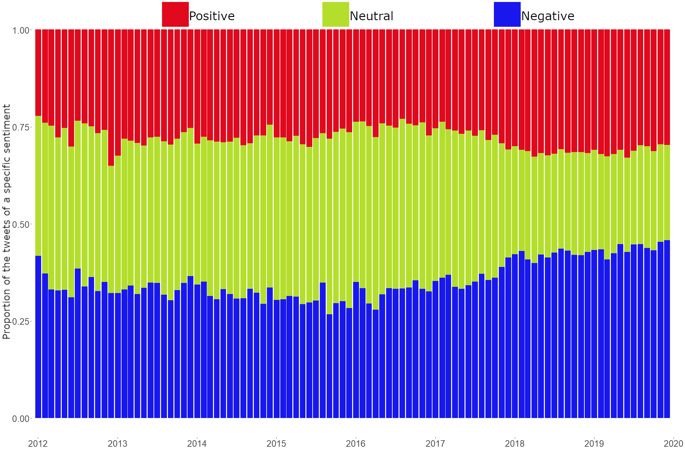
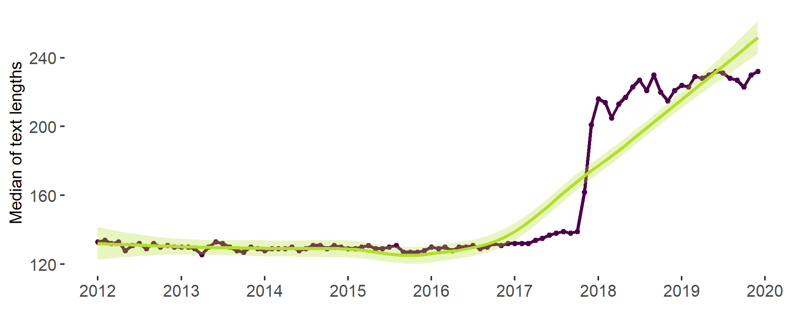

# Supplementary information for 
# Users' polarisation in dynamic discussion networks: the case of refugee crisis in Sweden


This document provides additional information on the data handling, methods and results and complements the main text of the manuscript. The document is compiled as an R script with comments, so, it is easy to understand how the data was transformed, which methods were used and how the results were received. Results that were mentioned in the main manuscript but not elaborated upon in the paper, highlighted in the Supplementary information as blocks of text with images.

Due to ethical concerns, we are not allowed to provide the full dataset of the collected tweets. The IDs of the analysed tweets are provided on demand.

The code follows the parts of the analysis in the logical order.
## Dynamic community detection
The first step in the analysis was to distinguish dynamic communities of users. Firstly, we have subsetted the network to keep only active users (i.e., those who posted more than 5 tweets in a month) and created the edgelist, where nodes were the users and edges were the replies and mentions. 


```r
# The following block of code finds those users, who posted more than 5 
# Twitter messages in a month, and creates a new object 
# nodes_active specifying active users in a given month

# Loading the dataset
load("twitter_df.RData")

# Creating a new vriable "month"
twitter_df$month <- format.Date(as.Date(twitter_df$created_at),"%Y-%m")


# Loading the needed packages for data transformations
#install.packages(c("tidyr","dplyr"),dependencies = T)
library(tidyr)
library(dplyr)

# Identifying users who posted more than 5 messages in a given month
nodes_active <- twitter_df %>%
  select (user_id, text, month)%>% # Selecting only the needed columns
  group_by (user_id)%>% # Group_by the user
  group_by (month, .add = T)%>% # Group_by the month when the tweet 
  # was posted
  summarise (n= n())%>% # Counting the number of tweets
  filter (n >5)%>% # Keeping only those that are more than 5
  as.data.frame() 

# Subsetting the df
data<-twitter_df[which(twitter_df$user_id %in% nodes_active$user_id),]

# Creating a new object that will store the months and their numbers
time <- 1:96 # Months' numbers
names(time) <- sort(unique(nodes_active$month)) # Months themselves
```


```r
# The following block of code creates edge lists for each time period
# In R
# Subsetting the dataframe
active_edgelists<-data[,c("user_id","reply_to_user_id","mentions_user_id","created_at","month")]

# Adding replies to the column mentions 
myfun<-function(x){
  if (is.na(x$mentions_user_id)){
    return(x$reply_to_user_id)
  } else {
    if (!(x$reply_to_user_id %in% x$mentions_user_id[[1]])){
      return(append(x$mentions_user_id[[1]],x$reply_to_user_id))
    } else {
      return(x$mentions_user_id)
    }
  }
}
active_edgelists$mentions_user_id<-apply(active_edgelists, 1, function(x) myfun(x))

# Unlisting the mentions column
active_edgelists<-unnest(active_edgelists, mentions_user_id)
# Dropping the replies column
active_edgelists<-active_edgelists[,-2]
active_edgelists<-na.omit(active_edgelists)

# Keeping only those mentions that are active themselves
active_edgelists<-active_edgelists[which(active_edgelists$mentions_user_id %in% nodes_active$user_id),]

names(active_edgelists)<-c("from","to","date_time","month")

# Adding the column with the month number
active_edgelists<-active_edgelists[order(active_edgelists$date_time),]
month_n<-as.data.frame(time)
names(month_n)<-"t"
month_n$month<-row.names(month_n)
active_edgelists<-left_join(active_edgelists,month_n)

# Saving the object
write.csv(active_edgelists,"edges.csv", row.names=FALSE)
```
After the edgelist was created, communities were found using the following algorithms: iterative detection and matching, label smoothing and smoothed Louvain. Use the tnetwork Python package to conduct the community detection. 

```py
# Loading the edgelist
# In Python
import pandas as pd
edges=pd.read_csv("edges.csv", index_col=None)

# Subsetting the df
edges = pd.DataFrame(edges,columns=['from','to',"t"])
edges=edges.drop_duplicates()
edges=edges.reset_index()

# Creating the snapshot network
import tnetwork as tn
dg_sn = tn.DynGraphSN(frequency=1)
for i in range(0,len(edges['from'])):
    dg_sn.add_interactions_from((edges['from'][i],edges['to'][i]),(edges['t'][i],edges['t'][i]+1))
    
# Looking for the communities applying the Iterative matching algorithm
com_iterative = tn.DCD.iterative_match(dg_sn)

# Looking for the communities applying the iterative community detection using 
# Clauset-Newman-Moore greedy modularity maximization and matching
import networkx as nx
custom_match_function = lambda x,y: len(x&y)/max(len(x),len(y))
com_custom = tn.DCD.iterative_match(dg_sn,match_function=custom_match_function,CDalgo=nx.community.greedy_modularity_communities,threshold=0.3)

# Looking for the communities applying label smoothing
com_survival = tn.DCD.label_smoothing(dg_sn)

# Looking for the communities applying smoothed Louvain
com_smoothed = tn.DCD.smoothed_louvain(dg_sn)
```
Dynamic partitions were evaluated based on the modularity at each step, consecutive similarity and global smoothness scores, such as the average value of partition smoothness, node smoothness and label smoothness.

```py
# Modularity at each step
quality_iter1,sizes_iter = tn.DCD.quality_at_each_step(com_iterative,dg_sn)
quality_survival1,sizes_survival = tn.DCD.quality_at_each_step(com_survival,dg_sn)
quality_smoothed1,sizes_smoothed = tn.DCD.quality_at_each_step(com_smoothed,dg_sn)
quality_customed1,sizes_customed = tn.DCD.quality_at_each_step(com_custom,dg_sn)

# Consecutive similarity
quality_customed2=tn.DCD.longitudinal_similarity(dg_sn,com_custom)
quality_iter2 = tn.DCD.longitudinal_similarity(dg_sn,com_iterative)
quality_survival2 = tn.DCD.longitudinal_similarity(dg_sn,com_survival)
quality_smoothed2 = tn.DCD.longitudinal_similarity(dg_sn,com_smoothed)

# Global smoothness
gs=pd.DataFrame({'Method' : ["custom","iterative","survival","smoothed"],
                 "SM-P":[tn.DCD.SM_P(com_custom),tn.DCD.SM_P(com_iterative),
                         tn.DCD.SM_P(com_survival),tn.DCD.SM_P(com_smoothed)],
                 "SM_N":[tn.DCD.SM_N(com_custom),tn.DCD.SM_N(com_iterative),
                         tn.DCD.SM_N(com_survival),tn.DCD.SM_N(com_smoothed)],
                 "SM-L":[tn.DCD.SM_L(com_custom),tn.DCD.SM_L(com_iterative),
                         tn.DCD.SM_L(com_survival),tn.DCD.SM_L(com_smoothed)]})
```
The results are presented by the following evaluation graph.

<div class="figure">

<p class="caption">Fig. 1. The results of the dynamic partition evaluation.</p>
</div>

In this paper, we used the communities learned by applying the iterative community detection using Clauset-Newman-Moore greedy modularity maximization and matching.

```py
# Extracting the communities
# All nodes belonged to several communities within the examined time period
# The main community of each node is the communitity, in which the node appeared the most
p=com_custom.affiliations()
df_com = pd.DataFrame({'node' : [],'community':[]})
for i in p.keys():
    main_com_len=1
    for j in p[i].keys():
        
        if len(p[i][j])>main_com_len:
            main_com=j
            main_com_len=len(p[i][j])
    df_com=df_com.append({'node' : i,'community':main_com},ignore_index=True)

# Saving the df for the latter use
df_com.to_csv('dyn_com.csv',index=False)
```
```r
# Adding the results into the df 
# In R
memb_df<-read.csv("dyn_com.csv")
names(memb_df)<-c("user_id","dyn_cluster") # renaming the columns

# Merge the results with the main dataframe
data<-left_join(data,memb_df)
# Now, we have a new column dyn_cluster
```
## Sentiment analysis

After acquiring the information about the placement of users in the dynamic clusters, we have conducted sentiment analysis using VADER. 
```r
# Adding the column doc_id
data$doc_id<-1:length(data$text)

# Exporting the texts of the tweets
write.csv(data[,c("doc_id","text")],
          file=file('tweet_texts.csv',encoding="UTF-8"))
```
```py
# Loading the data in Python
import pandas as pd
from vaderSentiment.vaderSentiment import SentimentIntensityAnalyzer

# load the texts
data = pd.read_csv('tweet_texts.csv')

# preprocess texts (remove urls, mentions and e-mail addresses, as well as html markup)
text = data["text"].astype(str) 

# remove html markup
text = text.str.replace('<.*?>|&([a-z0-9]+|#[0-9]{1,6}|#x[0-9a-f]{1,6});',' ')

# remove tabs
text= text.str.replace('[ |\t]{2,}', '', case=False)

# remove urls 
text= text.str.replace('http\S+|www.\S+', '', case=False)

# remove e-mails
text= text.str.replace('\S+@\S+', '', case=False)

# remove mentions
text= text.str.replace('@\S+', '', case=False)

# remove additional links
text= text.str.replace('bit\.ly\S+', '', case=False)

# adding a new column to the df
data['clean_text']=text

# run sentiment analysis with VADER 
analyzer = SentimentIntensityAnalyzer()
vs_res=[]
for row in text:
    
    vs = analyzer.polarity_scores(row)
    vs_res.append(vs)
    
sample_list_vader = [item for item in vs_res]
sample_scores_vader =[item['compound'] for item in sample_list_vader]   

data =data.assign(vader_score = pd.Series(sample_scores_vader))
```

We repeated the same actions to calculate sentiments of the manually annotated texts.

```py
# repeat sentiment analysis on the manually annotated tweets
test = pd.read_csv('annotated_texts.csv', encoding='utf-8')

# preprocess texts (remove urls, mentions and e-mail addresses, as well as html markup)
test = test["text"].astype(str) 

# remove html markup
text = text.str.replace('<.*?>|&([a-z0-9]+|#[0-9]{1,6}|#x[0-9a-f]{1,6});','')

# remove tabs
text= text.str.replace('[ |\t]{2,}', '', case=False)

# remove urls 
text= text.str.replace('http\S+|www.\S+', '', case=False)

# remove e-mails
text= text.str.replace('\S+@\S+', '', case=False)

# remove mentions
text= text.str.replace('@\S+', '', case=False)

# remove additional links
text= text.str.replace('bit\.ly\S+', '', case=False)

# perform sentiment analysis
vs_res=[]
for row in text:
    vs = analyzer.polarity_scores(row)
    vs_res.append(vs)

list_vader = [item for item in vs_res]
vader_score =[item['compound'] for item in list_vader]
test = test.assign(vader_score = pd.Series(vader_score))

# save the results 
data.to_csv('texts_with_sentiment_scores.csv',encoding='utf-8-sig')
test.to_csv('test_dataset.csv',encoding='utf-8-sig')
```
### Reliability test
After, we computed the VADER scores for the annotated tweets, we examined the distribution of the sentiment value in each stance group, identified by author, who annotated the texts.
```r
# Loading the test dataset
# Here, column coding contains the scores identified by the author,
# who annotated the texts
test<-read.csv("test_dataset.csv",header=T,encoding="UTF-8")

# Visualising the results
library(ggplot2)

p1<-ggplot(test, aes(x=vader_score, color=coding,fill=coding)) +
  geom_density(alpha=0.8)+
  theme(panel.background = element_rect(fill = NA),
        legend.position = "top",
        legend.title = element_blank(),
        axis.text = element_text(size=20),
        axis.title = element_text(size=24))+
  scale_color_manual(values = c("#1818ee","#b4de2c","#e1091d"))+
  scale_fill_manual(values = c("#1818ee","#b4de2c","#e1091d"))+
  ylab("Density")+xlab("")


p2<-ggplot(test, aes(x=vader_score, color=coding,fill=coding)) +
  geom_boxplot(notch=T,lwd=3)+
  theme(panel.background = element_rect(fill = NA),
        legend.position = "none",
        axis.text = element_text(size=20),
        axis.title = element_text(size=24))+
  scale_color_manual(values = c("#1818ee","#b4de2c","#e1091d"))+
  scale_fill_manual( values =alpha(c("#1818ee","#b4de2c","#e1091d"), .8))+
  ylab("")+xlab("Sentiment value")

library(ggpubr)
ggarrange(p1,p2,nrow=2)
```

<div class="figure">

<p class="caption">Fig. 2. Test statistics on the VADER's accuracy of measuring the tonality of the tweets.</p>
</div>

The test also helped us to find the border values for each group of the texts: in particular, positive, neutral and negative. The border values were found using the CDF and grid-search approaches.

```r
# Calculating the border values
# CDF for calculating the negative - neutral boundary
x_pos_neu <- subset(test, coding != 'neg')$vader_score
x_neg <- subset(test, coding == 'neg')$vader_score

pdf1 <- density(x_pos_neu)
f1 <- approxfun(pdf1$x, pdf1$y, yleft = 0, yright = 0)
cdf1 <- function(z){
  integrate(f1, -Inf, z)$value
}

pdf2 <- density(x_neg)
f2 <- approxfun(pdf2$x, pdf2$y, yleft = 0, yright = 0)
cdf2 <- function(z){
  integrate(f2, -Inf, z)$value
}

Target <- function(t){
  1 - cdf1(t) - cdf2(t)
}

lower_b<-uniroot(Target, range(c(x_pos_neu, x_neg)))$root

# CDF for calculating the neutral - positive boundary
x_neg_neu <- subset(test, coding != 'pos')$vader_score
x_pos <- subset(test, coding == 'pos')$vader_score

pdf1 <- density(x_neg_neu)
f1 <- approxfun(pdf1$x, pdf1$y, yleft = 0, yright = 0)
cdf1 <- function(z){
  integrate(f1, -Inf, z)$value
}

pdf2 <- density(x_pos)
f2 <- approxfun(pdf2$x, pdf2$y, yleft = 0, yright = 0)
cdf2 <- function(z){
  integrate(f2, -Inf, z)$value
}

Target <- function(t){
  1 - cdf1(t) - cdf2(t)
}

higher_b<-uniroot(Target, range(c(x_neg_neu, x_pos)))$root

# Grid search for the border values giving the highest accuracy,
# the value of y = T_pos - F_pos + T_neg - F_neg
# and recall for all of the categories.
grid_try<-expand.grid(seq(lower_b-0.3,lower_b+0.3,0.0001),
            seq(higher_b-0.3,higher_b+0.3,0.0001))

library(caret)
# Calculating the values of accuracy, y and recall
grid_search_fun<-function(lower_b_value,higher_b_value,test){
  test<-test %>% mutate(vader_group =
                      case_when(vader_score < lower_b_value ~ "neg", 
                                vader_score <= higher_b_value ~ "neu",
                                vader_score > higher_b_value ~ "pos"))
  # create the confusion matrix
  cm = as.matrix(table(Actual = test$coding, 
                       Predicted = test$vader_group)) 
  n = sum(cm) # number of instances
  diag = diag(cm) # number of correctly classified instances per class 
  rowsums = apply(cm, 1, sum) # number of instances per class
  accuracy = sum(diag) / n 
  # y = T_pos - F_pos + T_neg - F_neg
  if (ncol(cm)==3){
  y<-cm[3,3]-(sum(cm[,3])-cm[3,3])+cm[1,1]-(sum(cm[,1])-cm[1,1])
  }else{
  y<-0}
  
  recall = diag / rowsums 
  recall
  return(append(c(accuracy,y,recall))
  
}

# Applying the function
res<-apply(grid_try, 1, function(x) grid_search_fun(x[1],x[2],test))%>%
  t()%>%as.data.frame()
names(res)<-c("accuracy","y","recall_sum","neg","neu","pos")
# Adding a column with the sum of all of the parameters
res<-cbind(res,f=apply(res, 1, sum))
# Finding the columns that give the maximum values
res[which(res$f==max(res$f)),]
# Choosing those border values that are in the subset and the closest 
# to lower_b and higher_b
grid_try[which(res$f==max(res$f)),]
# In this case those are -0.092 and 0.1284

# Adding the column with the VADER category to the main dataset
data_vader<-read.csv("texts_with_sentiment_scores.csv",header=T,encoding="UTF-8")%>%
               select("doc_id","vader_score","clean_text")
data<-data %>% left_join(.,data_vader) %>%
               mutate(vader_group =
                        case_when(vader_score < -0.092 ~ "neg", 
                                  vader_score <= 0.1284 ~ "neu",
                                  vader_score > 0.1284 ~ "pos"))
```

### Robustness check 


```r
# The following block of code shows how the term-category association
# analysis was applied to check for robustness the results of dividing 
# the tweets into positive, negative and neutral

# Creating a quanteda tokens object
# Taking tokens from the df
library(quanteda)
tok<-quanteda::tokens(data$clean_text, 
                      remove_punct = TRUE,
                      remove_numbers = TRUE,
                      remove_symbols = FALSE, 
                      remove_url = TRUE)
docvars(tok)<-data[,c("doc_id","vader_group")]
meta(tok)<-data[,c("doc_id","vader_group")]

# Creating a document-term matrix
dtm <- quanteda::dfm(tok)

# Dropping empty documents
dtm2<-dfm_subset(dtm, ntoken(dtm) > 0)


# TCA is applied using the SpeedReader package
# install.packages("SpeedReader",dependencies=T)
library(SpeedReader)
dtm_triplet <- SpeedReader::convert_quanteda_to_slam(dtm2)

# Extracting the document features, so, we can use them to create a
# contingency table:
document_covariates <- docvars(dtm2)

# Creating a contingency table
term_group_table <- contingency_table(
  metadata = document_covariates,
  document_term_matrix = dtm_triplet,
  variables_to_use = c("vader_group"),
  threshold = 7
)

# Calculating average number of terms per category
avg_terms_per_category <- mean(slam::row_sums(term_group_table))

# Selecting the features to present on the graph
top_features <- feature_selection(term_group_table,
                                  rows_to_compare = c(3,1),
                                  alpha = avg_terms_per_category*0.1,
                                  method = "informed Dirichlet",
                                  rank_by_log_odds = F)

# Producing a fighting words plot
# Using negative and positive categories
fightin_words_plot(top_features,
                   positive_category = "Pro migration",
                   negative_category = "Against migration",
                   max_terms_to_display = 1000)
```

The following graph shows the terms most likely to be associated with positive and negative tweets
<div class="figure">

<p class="caption">Fig. 3. Terms most likely associated with negative and positive tweets</p>
</div>


## Analysing the results

### Statistics on the number of active users in each of the dynamic clusters


```r
# The following block of code shows how to use streamgraph 
# visualization technique to produce Fig. 1 of the main manuscript 

# Installing needed packages
#install.packages(c("streamgraph","lubridate"),dependencies=T)
library(streamgraph) # for visualization
library(lubridate) # for grouping by date

# Loading needed variables from the df
vis1<-data[,c("user_id","created_at","dyn_cluster")] %>%
  # Creating a new variable month  
  mutate(month=floor_date(created_at, "month"))%>%
  # Visualizing only those users that are in the dynamic communities  
  filter(!is.na(dyn_cluster))%>%
  # Dropping the date
  select(user_id,month,dyn_cluster)%>%
  # To calculate the number of users, we need to drop duplicated rows
  unique()%>%
  # Counting the number of users within each dynamic cluster 
  # in each time period
  group_by(month,dyn_cluster) %>% 
  dplyr::summarise(num_of_u=n())

# Building the graph
vis1%>%
  streamgraph("dyn_cluster", "num_of_u", "month",interactive=F)%>%
  sg_axis_x(tick_interval=12,"month","%Y")%>%
  sg_add_marker(x=as.Date("2015-09-01",format="%Y-%m-%d"),
                color="black",stroke="#3f007d",
                label="Alan Kurdi's death and 'Refugees Welcome' demonstrations")%>%
  sg_add_marker(x=as.Date("2015-11-01",format="%Y-%m-%d"),
                color="black",stroke="#3f007d",
                label="Border checks introduced", y=90) %>%
  sg_add_marker(x=as.Date("2016-01-01",format="%Y-%m-%d"),
                color="black",stroke="#3f007d",
                label="Border checks come into force",y=180) %>%
  sg_add_marker(x=as.Date("2016-06-01",format="%Y-%m-%d"),
                color="black",stroke="#3f007d",
                label="Change in the Reception of Asylum Seekers Act",
                y=140) %>%
  sg_fill_brewer("BuPu")
```

<div class="figure">

<p class="caption">Fig. 4. Growth of the users’ clusters in time</p>
</div>


### Number of positive, negative and neutral tweets over time


```r
# The following block of code shows how to visualize the proportion  
# difference between  the  number  of  negative  and  positive 
# tweets over time
# install.packages("reshape2", dependencies=T)
library(reshape2)

# Subsetting the df
vis2<-data%>%
  count(month,vader_label)%>%
  spread(., key = vader_label, value =n )%>%
  mutate(sum=pos+neg+neu)%>%
  mutate(pos=pos/sum,neu=neu/sum,neg=neg/sum)%>%
  select(month,pos,neu,neg)%>%
  melt(., id.vars=c("month"))%>%
  mutate(month=as.Date(paste0(month,"-01"),"%Y-%m-%d"))
  
# For the visualisation purposes, releveling the vader_group variable
levels(vis2$variable)<-c("Positive","Neutral","Negative")

# Setting up the colors
mycolors=c("#e1091d","#b4de2c","#1818ee")

# Visualising
# install.packages("ggplot2", dependencies=T)
library(ggplot2)
ggplot(vis2, aes(x=month,y=value,color=variable,fill=variable)) + 
  geom_bar(stat="identity")+
  theme(panel.background = element_rect(fill = NA),
        legend.position = "top",
        legend.title = element_blank(),
        legend.text = element_text(size=24),
        axis.text = element_text(size=20),
        axis.title = element_text(size=24))+
  ylab("Proportion of the tweets of a specific sentiment")+xlab("")+
  scale_color_manual(values=mycolors)+
  scale_fill_manual(values=mycolors)+
  scale_x_date(date_breaks = "1 year", date_labels = "%Y")

```

<div class="figure">

<p class="caption">Fig. 5. Proportion of the tweets of a specific sentiment.</p>
</div>

### Standard deviation and the mean of the sentiment values over time (in the whole network)

```r
# The following block of code shows how to visualize the 
# mean and standard deviation of sentiment values over time

# Reshaping the df for the visualisation purposes
vis3<-data%>%
  group_by(month)%>%
  summarise(sd=sd(vader_score,na.rm=T),
            mean=mean(vader_score,na.rm=T),
            kurtosis=kurtosis(vader_score,na.rm=T))%>%
  melt(., id.vars=c("month"))%>%
  mutate(month=as.Date(paste0(month,"-01"),"%Y-%m-%d"))

# SD plot
p1<-ggplot(vis3[which(vis3$variable=="sd"),], aes(x=month,y=value)) +
  geom_point(size = 1.1,color="#4d004b") + # adding the points
  geom_line(color="#4d004b",lwd=1)+ # adding the line connecting the points
  geom_smooth(method = "loess", color = "#b4de2c", fill = "#b4de2c",alpha=0.3)+
  # adding the regression line
  theme(panel.background = element_rect(fill = NA),
        legend.position = "none",
        axis.text = element_text(size=10),
        axis.title=element_text(size=10))+
  ylab("SD of sentiment values")+xlab("")+
  scale_x_date(date_breaks = "1 year", date_labels = "%Y")+
  scale_y_continuous(breaks = seq(-0.2, 4, by = 0.05))

# Mean plot
p2<-ggplot(vis3[which(vis3$variable=="mean"),], aes(x=month,y=value)) +
  geom_point(size = 1.1,color="#4d004b") +
  geom_line(color="#4d004b",lwd=1)+
  geom_smooth(method = "loess", color = "#b4de2c", fill = "#b4de2c",alpha=0.3)+
  theme(panel.background = element_rect(fill = NA),
        legend.position = "none",
        axis.text = element_text(size=10),
        axis.title=element_text(size=10))+
  ylab("Mean of sentiment values")+xlab("")+
  scale_x_date(date_breaks = "1 year", date_labels = "%Y")+
  scale_y_continuous(breaks = seq(-0.2, 4, by = 0.05))
  
# Kurtosis plot
p3<-ggplot(vis3[which(vis3$variable=="kurtosis"),], aes(x=month,y=value)) +
  geom_point(size = 1.1,color="#4d004b") +
  geom_line(color="#4d004b",lwd=1)+
  geom_smooth(method = "loess", color = "#b4de2c", fill = "#b4de2c",alpha=0.3)+
  theme(panel.background = element_rect(fill = NA),
        legend.position = "none",
        axis.text = element_text(size=10),
        axis.title=element_text(size=10))+
  ylab("Kurtosis of sentiment values")+xlab("")+
  scale_x_date(date_breaks = "1 year", date_labels = "%Y")+
  scale_y_continuous(breaks = seq(-1, 0, by = 0.3))
# Producing the plots
ggarrange(p1,p2,p3,nrow=3)

```
<div class="figure">

<p class="caption">Fig. 6. Mean, standard deviation and kurtosis of the overall sentiment values.</p>
</div>


### Distribution of the sentiment values during the key periods (both in the network and its communities)


```r
# The following block of code shows how to visualize 
# the distribution of the sentiment values during the key periods 

# Installing the needed package
#install.packages(c("viridis","ggeasy"), dependencies = T)
library(viridis)
library(ggeasy)

# Distribution in the whole network
vis4<-data%>% filter(month %in% 
                       c("2012-01","2015-12","2017-10","2019-12")& 
                       vader_score!=0)
vis4$group<-as.factor(as.character(vis4$month))
levels(vis4$group)<-c("January 2012", "December 2015", 
                      "October 2017", "December 2019")

p1<- ggplot(vis4, aes(x=vader_score)) +
  geom_histogram(fill="#4d004b", position="dodge",
                 binwidth = 0.05,color="#bfd3e6",lwd=1)+
  facet_wrap(~group)+
  theme(panel.background = element_rect(fill = NA),
        legend.position = "none",
        axis.text = element_text(size=20),
        axis.title = element_text(size = 24),
        strip.text = element_text(size = 24),
        strip.background = element_blank(),
        plot.title = element_text(size = 28))+
  ylab("Density")+xlab("")+
  ggtitle("Overall distribution of the sentiment values")+
  ggeasy::easy_center_title()

# With the 0 values
vis4<-data%>% filter(month %in% 
                       c("2012-01","2015-12","2017-10","2019-12"))
vis4$group<-as.factor(as.character(vis4$month))
levels(vis4$group)<-c("January 2012", "December 2015", 
                      "October 2017", "December 2019")

p2<- ggplot(vis4, aes(x=vader_score)) +
  geom_histogram(fill="#4d004b", position="dodge",
                 binwidth = 0.05,color="#bfd3e6",lwd=1)+
  facet_wrap(~group)+
  theme(panel.background = element_rect(fill = NA),
        legend.position = "none",
        axis.text = element_text(size=20),
        axis.title = element_text(size = 24),
        strip.text = element_text(size = 24),
        strip.background = element_blank(),
        plot.title = element_text(size = 28))+
  ylab("")+xlab("")+
  ggtitle("Overall distribution of the sentiment values")+
  ggeasy::easy_center_title()

# Across the big communities
# Finding the biggest communities
temp<-unique(data[,c("user_id","dyn_cluster")])
temp<-temp%>%
  group_by(dyn_cluster)%>%
  summarise(n_users=n())%>%
  arrange(-n_users)
big_com<-temp[c(2:11),1]# choosing 10 biggest excluding NAs

vis4<-data%>% filter(month %in% 
                       c("2012-01","2015-12","2017-10","2019-12")&
                       dyn_cluster %in% big_com$dyn_cluster& 
                       vader_score!=0)
vis4$group<-as.factor(as.character(vis4$month))
levels(vis4$group)<-c("January 2012", "December 2015", 
                      "October 2017", "December 2019")
                      
p3<- ggplot(vis4, aes(x=vader_score,
                      color=dyn_cluster,
                      fill=dyn_cluster)) +
  geom_histogram(position="stack",
                 binwidth = 0.05,lwd=1)+
  facet_wrap(~group)+
  theme(panel.background = element_rect(fill = NA),
        legend.position = "none",
        axis.text = element_text(size=20),
        axis.title = element_text(size = 24),
        strip.text = element_text(size = 24),
        strip.background = element_blank(),
        plot.title = element_text(size = 28))+
  scale_color_viridis(discrete = T, option = "D")+
  scale_fill_viridis(discrete = T, option = "D")+
  ylab("Density")+xlab("")+
  ggtitle("Distribution of the sentiment values in the 10 biggest communities")+
  ggeasy::easy_center_title()

# With the 0 values
vis4<-data%>% filter(month %in% 
                       c("2012-01","2015-12","2017-10","2019-12")&
                       dyn_cluster %in% big_com$dyn_cluster)
vis4$group<-as.factor(as.character(vis4$month))
levels(vis4$group)<-c("January 2012", "December 2015", 
                      "October 2017", "December 2019")

p4<- ggplot(vis4, aes(x=vader_score,
                      color=dyn_cluster,
                      fill=dyn_cluster)) +
  geom_histogram(position="stack",
                 binwidth = 0.05,lwd=1)+
  facet_wrap(~group)+
  theme(panel.background = element_rect(fill = NA),
        legend.position = "none",
        axis.text = element_text(size=20),
        axis.title = element_text(size = 24),
        strip.text = element_text(size = 24),
        strip.background = element_blank(),
        plot.title = element_text(size = 28))+
  scale_color_viridis(discrete = T, option = "D")+
  scale_fill_viridis(discrete = T, option = "D")+
  ylab("")+xlab("")+
  ggtitle("Distribution of the sentiment values in the 10 biggest communities")+
  ggeasy::easy_center_title()

ggarrange(p1,p2,p3,p4,nrow=2,ncol=2)
```

<div class="figure">

<p class="caption">Fig. 7. Sentiment distributions during the key periods.</p>
</div>


### Hartigan’s dip test of unimodality

```r
install.packages("diptest",dependencies = T)
library(diptest)

# Dip test for the whole network

# Including messages with a score of 0
dip <-vector("list", length(month_n$month))
for (i in (1:length(dip))){
  dip [i]<-dip.test(data$vader_score[data$month == month_n$month[i]])$statistic
}

# Excluding messages with the score of 0
dipn <-vector("list", length(month_n$month))
for (i in (1:length(dipn))){
  dipn [i]<- dip.test(data$vader_score [data$month == month_n$month[i] & 
                                          data$vader_score !=0])$statistic
}

# Create a df with the values for dip statistic and plot them
dipdf <- data.frame(dip_stat = unlist(dip), 
                    dip_statn = unlist (dipn),
                    month = month_n$month)%>%
  melt(., id.vars=c("month"))%>%
  mutate(month=as.Date(paste0(month,"-01"),"%Y-%m-%d"))

levels(dipdf$variable)<-c("Including neutral tweets",
                          "Excluding neutral tweets")

ggplot(dipdf, 
       aes(x=month,y=value,colour = variable))+
  geom_line(lwd=1.5)+
  theme(panel.background = element_rect(fill = NA),
        legend.position = "top",
        legend.title = element_blank(),
        axis.text = element_text(size=20),
        legend.text = element_text(size = 24),
        axis.title = element_text(size = 24),
        strip.text = element_text(size = 24),
        plot.title = element_text(size = 28))+
  scale_color_manual(values=mycolors)+
  scale_fill_manual(values=mycolors)+
  ylab("Dip statistic")+xlab("")+
  ggtitle("")+
  ggeasy::easy_center_title()+
  scale_x_date(date_breaks = "1 year", date_labels = "%Y")
```

<div class="figure">

<p class="caption">Fig. 8. Hartigan's Dip test statistic on the network level.</p>
</div>

```r
# Dip test for the network communities

dc <- unique(data$dyn_cluster)%>%na.omit()

# Create a function that would perform Dip test for each of the clusters

dip <- function(df, cluster) {
  dip0 <-vector("list", length(month_n$month))
  dip0n <-vector("list", length(month_n$month))
  dip0p<-vector("list", length(month_n$month))
  dip0pn<-vector("list", length(month_n$month))
  
  for (i in (1:length(month_n$month))) {
    a<- na.omit(df$vader_score [ (df$month == month_n$month[i]) & 
                                   (df$dc == cluster)])
    
    if (length(a)>30) {
      a0<- dip.test(a)
      dip0 [i]<-a0$statistic
      dip0p [i] <- a0$p.value
    }else {
      dip0[i]<-NA
      dip0p [i] <-NA
    }
    
    a<- na.omit(df$vader_score [ (df$month == month_n$month[i]) & 
                                   (df$dc == cluster)& 
                                   (df$vader_score != 0)])
    
    if (length(a)>30) {  
      a0n<- dip.test(a)
      dip0n [i]<-a0n$statistic
      dip0pn [i] <- a0$p.value
    }else {
      dip0n[i]<-0
      dip0pn [i] <-0
    }
  }
  
  dipdf <- na.omit(data.frame(dip_stat = unlist(dip0), 
                              dip_p = unlist (dip0p),
                              dip_statn = unlist(dip0n),
                              dip_pn = unlist (dip0pn),
                              month= month_n$month))
  
  return(dipdf)
}


clus<-data %>% 
  select (month, dyn_cluster) %>%
  dplyr::group_by (month) %>% 
  summarise(num = length(unique(dyn_cluster)))


#run the function
dc_dfs <-vector("list", length(dc))

for (i in (1:length(dc))){
  dc_dfs[[i]] <- dip (data, cluster = dc[i])
}

#calculate the ratio of polarized communities across the months

vals_ratio <- vector ("list", length(month_n$month))

for (i in (1:length(month_n$month))) {
  vals <- vector ("list", length(dc))
  vals_bin <- vector ("list", length(dc))
  
  for (j in (1:length(dc_dfs)))  {
    vals [[j]] <- dc_dfs[[j]][["dip_pn"]][dc_dfs[[j]][["month"]] == month_n$month[i]]
    vals_bin[[j]] <- ifelse (vals[[j]]<=0.05, 1, 0)
  }
  
  vals_ratio [i] <- sum(unlist(vals_bin)) / length(which(vals>=0))
}


#build a df and plot the results
df_vals <- data.frame (month = month_n$month,
                       Ratio = unlist(vals_ratio))

#install.packages("plotrix",dependencies = T)
library(plotrix)
library(lubridate)
my_colors = c("#9ebcda","#8c96c6","#8c6bb1","#88419d")
clplot(x=decimal_date(ymd(paste0(df_vals$month,"-01"))), 
       y=df_vals$Ratio, lwd=3, 
       levels=c(0.4,0.6,0.8), col=my_colors,
       showcuts=T , bty="n",xlab="",
       ylab=expression("Ratio of polarised communities"))
```

<div class="figure">

<p class="caption">Fig. 9. Ratio of polarised communities in the network.</p>
</div>

### Mean and SD of the sentiment values in the 10 biggest communities


```r
# The following block of code shows how to visualize the  the mean and SD
# of the sentiment values in the biggest communities. Also, for the comparison,
# the sentiment value per user is calculated.

# Calculating the mean and SD of the sentiment values in big clusters
vis5<-data%>%filter(dyn_cluster %in% big_com$dyn_cluster)%>%
  group_by(month,dyn_cluster)%>%
  summarise(sd=sd(vader_score,na.rm=T),
            mean=mean(vader_score,na.rm=T))%>%
  melt(., id.vars=c("month","dyn_cluster"))%>%
  mutate(month=as.Date(paste0(month,"-01"),"%Y-%m-%d"))

# Visualising the SD
p1<-ggplot(vis5[which(vis5$variable=="sd"),], 
           aes(x=month,y=value,color=dyn_cluster)) +
  geom_smooth(method = "loess",se=FALSE,lwd=2)+
  theme(panel.background = element_rect(fill = NA),
        legend.position = "none",
        axis.text = element_text(size=20),
        axis.title=element_text(size=24))+
  scale_color_viridis(discrete = T, option = "D")+
  scale_fill_viridis(discrete = T, option = "D")+
  ylab("SD of sentiment values")+xlab("")+
  scale_x_date(date_breaks = "1 year", date_labels = "%Y")+
  scale_y_continuous(breaks = seq(-0.2, 4, by = 0.05))

# Visualising the mean
p2<-ggplot(vis5[which(vis5$variable=="mean"),], 
           aes(x=month,y=value,color=dyn_cluster)) +
  geom_smooth(method = "loess",se=FALSE,lwd=2)+
  theme(panel.background = element_rect(fill = NA),
        legend.position = "none",
        axis.text = element_text(size=20),
        axis.title=element_text(size=24))+
  scale_color_viridis(discrete = T, option = "D")+
  scale_fill_viridis(discrete = T, option = "D")+
  ylab("Mean of sentiment values")+xlab("")+
  scale_x_date(date_breaks = "1 year", date_labels = "%Y")+
  scale_y_continuous(breaks = seq(-0.2, 4, by = 0.05))

# Calculating sentiment per user
# Sum of the sentiment scores per community in a month
temp1<-data%>%filter(dyn_cluster %in% big_com$dyn_cluster)%>%
  group_by(month,dyn_cluster)%>%
  summarise(sum=sum(vader_score))%>%
  mutate(month=as.Date(paste0(month,"-01"),"%Y-%m-%d"))

# Number of users in each community at a given month
temp2<-data%>%filter(dyn_cluster %in% big_com$dyn_cluster)%>%
  select(month,dyn_cluster,user_id)%>%unique()%>%
  group_by(month,dyn_cluster)%>%
  summarise(count=n())%>%
  mutate(month=as.Date(paste0(month,"-01"),"%Y-%m-%d"))

# Sentiment per user
vis5<-left_join(temp1,temp2)%>%mutate(proportion=sum/count)

# Visualising the sentiment per user
p3<-ggplot(vis5, aes(x=month,y=proportion,color=dyn_cluster)) +
  geom_smooth(method = "loess",se=FALSE,lwd=2)+
  theme(panel.background = element_rect(fill = NA),
        legend.position = "none",
        axis.text = element_text(size=20),
        axis.title=element_text(size=24))+
  scale_color_viridis(discrete = T, option = "D")+
  scale_fill_viridis(discrete = T, option = "D")+
  ylab("Sentiment value per user")+xlab("")+
  scale_x_date(date_breaks = "1 year", date_labels = "%Y")

ggarrange(p1,p2,p3,nrow=3)
```
<div class="figure">

<p class="caption">Fig. 10. Mean and standard deviation of sentiment values in the biggest dynamic communities.</p>
</div>

### The  proportion  of  the  homophilic relationships


```r
# The following block of code shows how to calculate and visualize 
# the  proportion  of  the  connections  between  the  users  
# expressing simmilar view

# Get sentiments of nodes in a given month
# Including neutral tweets
node_sent<-data%>%
  select(user_id, month, vader_group) %>%
  count(user_id,month,vader_group) %>%
  group_by(user_id,month) %>%
  mutate(sent = vader_group[n == max(n)][1])%>%
  select(user_id,month,sent)

# If the user, was not active this month, we can set up the sentiment 
# of the user as it was at the previous month
node_sent_all_months<-expand.grid(unique(data$user_id),
                                  unique(data$month))%>%
                      rename(user_id=Var1,month=Var2)%>%
                      arrange(desc(month))%>%
  left_join(.,node_sent[,c("user_id","month","sent")])%>%
  left_join(.,unique(data[,c("user_id","dyn_cluster")]))%>%
  arrange(user_id)%>%
  group_by(user_id)%>%
  fill(sent, .direction = "downup")%>%
  ungroup()

# Adding the sentiments to the edge-list
names(node_sent_all_months)<-c("from","month","sent1","dc1")
edges<-active_edgelists%>%left_join(.,node_sent_all_months)
names(node_sent_all_months)<-c("to","month","sent2","dc2")
edges<-left_join(edges,node_sent_all_months)

# Calculating the proportion of the homophilic relationships
vis_net<-edges%>%select(sent1,sent2,month)%>%na.omit()%>%
  group_by(month) %>%
  mutate(all = n())%>%
  ungroup()%>%
  filter(sent1==sent2)%>%
  group_by(month,all)%>%
  mutate(homo=n())%>%mutate(prop=homo/all)%>%
  select(month,prop)%>%unique()%>%
  mutate(category="Including neutral tweets")

# Taking the same steps but excluding neutral tweets
node_sent<-data%>%
  select(user_id, month, vader_group) %>%
  filter(vader_group!="neu")%>%
  count(user_id,month,vader_group) %>%
  group_by(user_id,month) %>%
  mutate(sent = vader_group[n == max(n)][1])%>%
  select(user_id,month,sent)

node_sent_all_months<-expand.grid(unique(data$user_id),
                                  unique(data$month))%>%
  rename(user_id=Var1,month=Var2)%>%
  arrange(desc(month))%>%
  left_join(.,node_sent[,c("user_id","month","sent")])%>%
  left_join(.,unique(data[,c("user_id","dyn_cluster")]))%>%
  arrange(user_id)%>%
  group_by(user_id)%>%
  fill(sent, .direction = "downup")%>%
  ungroup()

names(node_sent_all_months)<-c("from","month","sent1","dc1")
edges<-active_edgelists%>%left_join(.,node_sent_all_months)
names(node_sent_all_months)<-c("to","month","sent2","dc2")
edges<-left_join(edges,node_sent_all_months)

vis_net2<-edges%>%select(sent1,sent2,month)%>%na.omit()%>%
  group_by(month) %>%
  mutate(all = n())%>%
  ungroup()%>%
  filter(sent1==sent2)%>%
  group_by(month,all)%>%
  mutate(homo=n())%>%mutate(prop=homo/all)%>%
  select(month,prop)%>%unique()%>%
  mutate(category="Excluding neutral tweets")%>%
  rbind(.,vis_net)%>%
  mutate(category=as.factor(category),
                      month=as.Date(paste0(month,"-01"),"%Y-%m-%d"))

# Visualising
mycolors=c("#b4de2c","#4d004b")
p1<-ggplot(vis_net2, 
           aes(x=month,y=prop,group=category,
               colour = category,fill=category))+
  geom_line(lwd=1.5)+
  geom_point(size = 2) +
  geom_smooth(method = "loess", alpha=0.3)+
  theme(panel.background = element_rect(fill = NA),
        legend.position = "top",
        legend.title = element_blank(),
        axis.text = element_text(size=20),
        legend.text = element_text(size = 24),
        axis.title = element_text(size = 24),
        strip.text = element_text(size = 24),
        plot.title = element_text(size = 28))+
  scale_color_manual(values=mycolors)+
  scale_fill_manual(values=mycolors)+
  ylab(expression(y[1]))+xlab("")+
  ggtitle("Proportion of the homophilic relationships")+
  ggeasy::easy_center_title()+
  scale_x_date(date_breaks = "1 year", date_labels = "%Y")

# Proportion of the communities with the majority of the connections
# being homophilic
# Similar calculations take place here
node_sent<-data%>%
  select(user_id, month, vader_group) %>%
  count(user_id,month,vader_group) %>%
  group_by(user_id,month) %>%
  mutate(sent = vader_group[n == max(n)][1])%>%
  select(user_id,month,sent)

node_sent_all_months<-expand.grid(unique(data$user_id),
                                  unique(data$month))%>%
  rename(user_id=Var1,month=Var2)%>%
  arrange(desc(month))%>%
  left_join(.,node_sent[,c("user_id","month","sent")])%>%
  left_join(.,unique(data[,c("user_id","dyn_cluster")]))%>%
  arrange(user_id)%>%
  group_by(user_id)%>%
  fill(sent, .direction = "downup")%>%
  ungroup()

# Adding the sentiments to the edge-list
names(node_sent_all_months)<-c("from","month","sent1","dc1")
edges<-active_edgelists%>%left_join(.,node_sent_all_months)
names(node_sent_all_months)<-c("to","month","sent2","dc2")
edges<-left_join(edges,node_sent_all_months)%>%
  filter(dc1==dc2,is.na(dc1)==F)

vis_gr<-edges%>%select(sent1,sent2,month,dc1)%>%na.omit()%>%
  group_by(month,dc1) %>%
  mutate(all = n())%>%
  ungroup()%>%
  filter(sent1==sent2)%>%
  group_by(month,dc1,all)%>%
  mutate(homo=n())%>%mutate(prop=homo/all)%>%
  select(month,prop,dc1)%>%unique()

vis_gr<-vis_gr%>%
  group_by(month)%>%
  mutate(n_gr=n())%>%
  ungroup()%>%
  filter(prop>0.5)%>%
  group_by(month)%>%
  mutate(homo_com_n=n())%>%
  mutate(prop2=homo_com_n/n_gr)%>%select(month,prop2)%>%unique()%>%
  mutate(category="Including neutral tweets")

# Excluding neutral tweets  
node_sent<-data%>%
  select(user_id, month, vader_group) %>%
  filter(vader_group!="neu")%>%
  count(user_id,month,vader_group) %>%
  group_by(user_id,month) %>%
  mutate(sent = vader_group[n == max(n)][1])%>%
  select(user_id,month,sent)

node_sent_all_months<-expand.grid(unique(data$user_id),
                                  unique(data$month))%>%
  rename(user_id=Var1,month=Var2)%>%
  arrange(desc(month))%>%
  left_join(.,node_sent[,c("user_id","month","sent")])%>%
  left_join(.,unique(data[,c("user_id","dyn_cluster")]))%>%
  arrange(user_id)%>%
  group_by(user_id)%>%
  fill(sent, .direction = "downup")%>%
  ungroup()

# Adding the sentiments to the edge-list
names(node_sent_all_months)<-c("from","month","sent1","dc1")
edges<-active_edgelists%>%left_join(.,node_sent_all_months)
names(node_sent_all_months)<-c("to","month","sent2","dc2")
edges<-left_join(edges,node_sent_all_months)%>%
  filter(dc1==dc2,is.na(dc1)==F)

vis_gr2<-edges%>%select(sent1,sent2,month,dc1)%>%na.omit()%>%
  group_by(month,dc1) %>%
  mutate(all = n())%>%
  ungroup()%>%
  filter(sent1==sent2)%>%
  group_by(month,dc1,all)%>%
  mutate(homo=n())%>%mutate(prop=homo/all)%>%
  select(month,prop,dc1)%>%unique()

vis_gr2<-vis_gr2%>%
  group_by(month)%>%
  mutate(n_gr=n())%>%
  ungroup()%>%
  filter(prop>0.5)%>%
  group_by(month)%>%
  mutate(homo_com_n=n())%>%
  mutate(prop2=homo_com_n/n_gr)%>%select(month,prop2)%>%unique()%>%
  mutate(category="Excluding neutral tweets")%>%rbind(.,vis_gr)%>%
  mutate(category=as.factor(category),
         month=as.Date(paste0(month,"-01"),"%Y-%m-%d"))

p2<-ggplot(vis_gr2, 
           aes(x=month,y=prop2,group=category,
               colour = category,fill=category))+
  geom_line(lwd=1.5)+
  geom_point(size = 2) +
  geom_smooth(method = "loess", alpha=0.3)+
  theme(panel.background = element_rect(fill = NA),
        legend.position = "top",
        legend.title = element_blank(),
        axis.text = element_text(size=20),
        legend.text = element_text(size = 24),
        axis.title = element_text(size = 24),
        strip.text = element_text(size = 24),
        plot.title = element_text(size = 28))+
  scale_color_manual(values=mycolors)+
  scale_fill_manual(values=mycolors)+
  ylab(expression(y[2]))+xlab("")+
  ggtitle("Proportion of the communities with the majority of the relationships being homophilic")+
  ggeasy::easy_center_title()+
  scale_x_date(date_breaks = "1 year", date_labels = "%Y")

ggarrange(p1,p2,nrow=2)
```

<div class="figure">

<p class="caption">Fig. 11. Share of homogeneous edges in the network and share of network's communities with the majority of the relationships being homophilic.</p>
</div>

