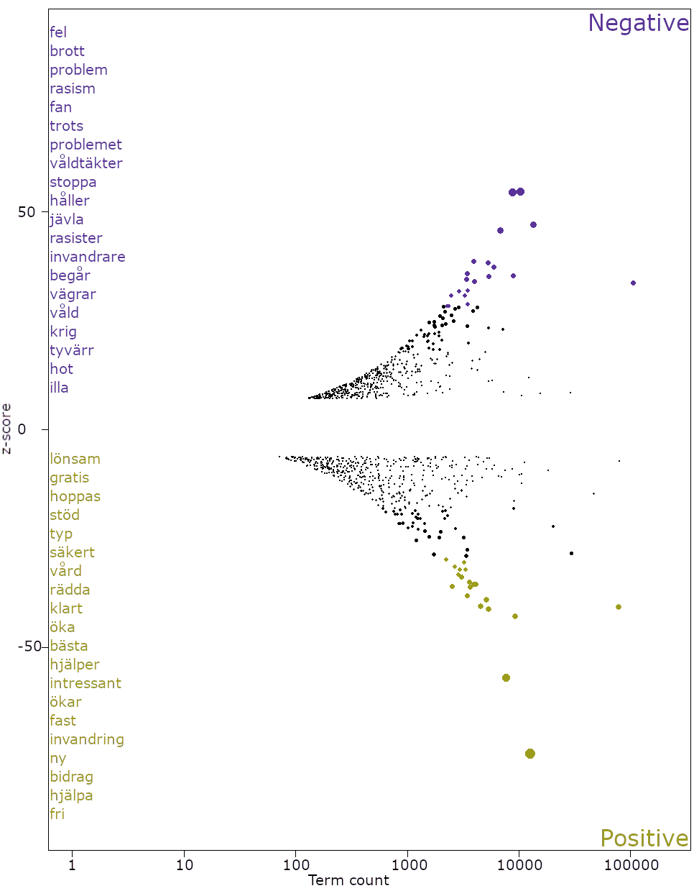
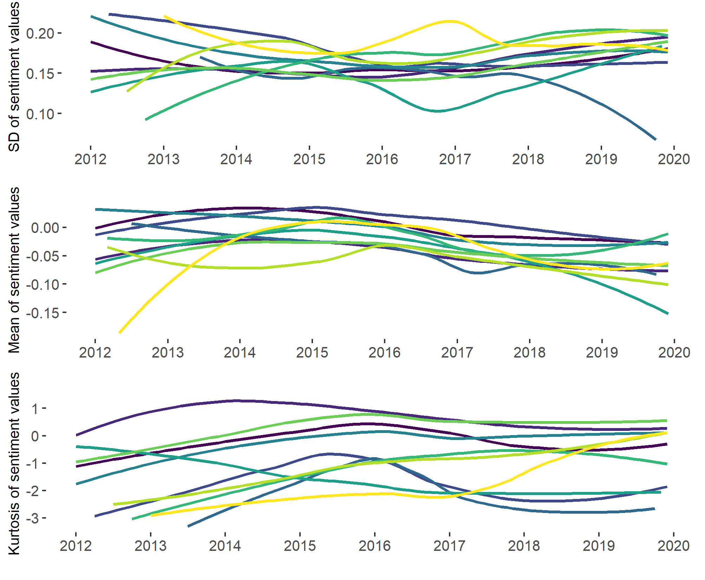
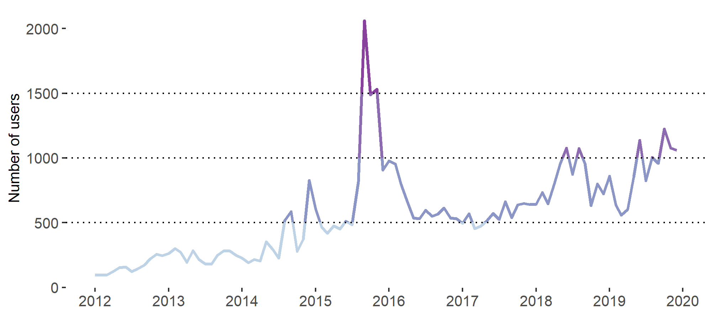
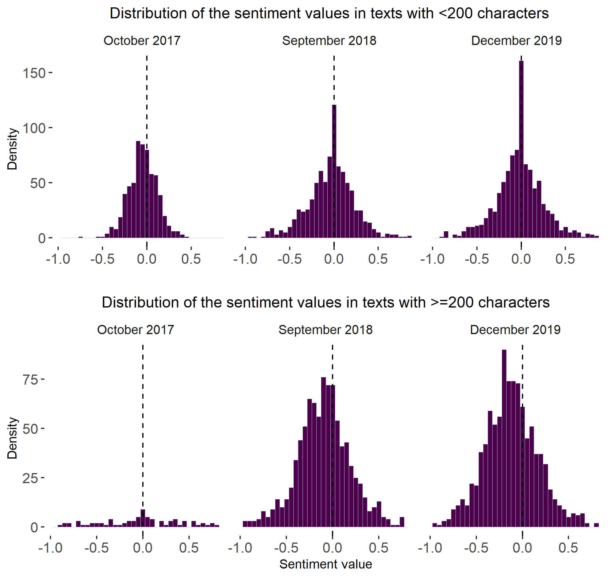
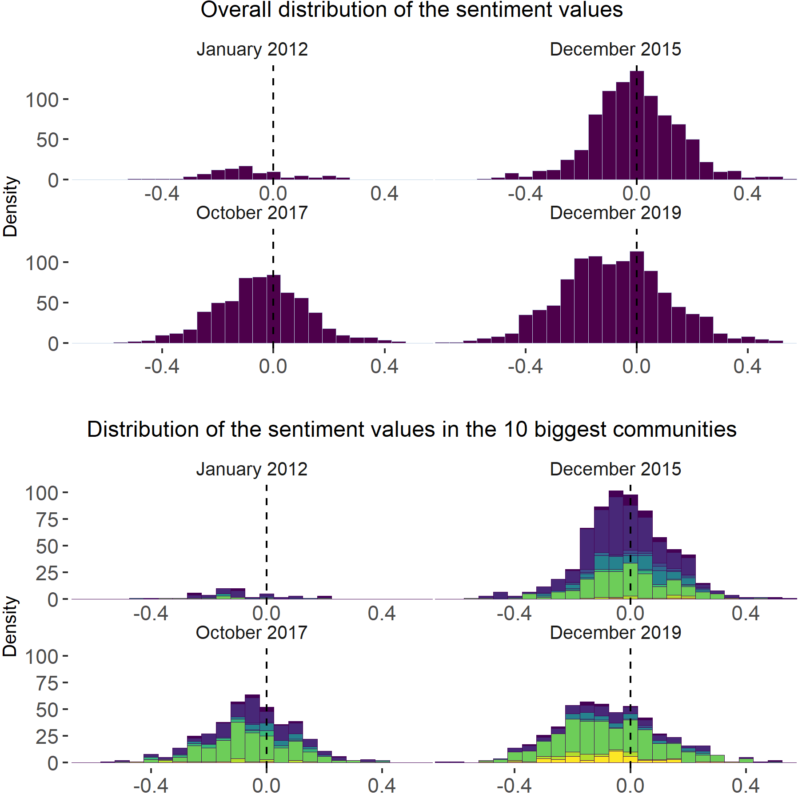

# Supplementary information for 
# Users' polarisation in dynamic discussion networks: the case of refugee crisis in Sweden


This document provides additional information on the data handling, methods and results and complements the main text of the manuscript. The document is compiled as an R script with comments, so, it is easy to understand how the data was transformed, which methods were used and how the results were received. Results that were mentioned in the main manuscript but not elaborated upon in the paper, highlighted in the Supplementary information as blocks of text with images.

Due to ethical concerns, we are not allowed to provide the full dataset of the collected tweets. The IDs of the analysed tweets are provided on demand.

The code follows the parts of the analysis in the logical order.
## Dynamic community detection
The first step in the analysis was to distinguish dynamic communities of users. Firstly, we have subsetted the network to keep only active users (i.e., those who posted more than 5 tweets in a month) and created the edgelist, where nodes were the users and edges were the replies and mentions. 


```r
# The following block of code finds those users, who posted more than 5 
# Twitter messages in a month, and creates a new object 
# nodes_active specifying active users in a given month

# Loading the dataset
load("twitter_df.RData")

# Creating a new vriable "month"
twitter_df$month <- format.Date(as.Date(twitter_df$created_at),"%Y-%m")


# Loading the needed packages for data transformations
#install.packages(c("tidyr","dplyr"),dependencies = T)
library(tidyr)
library(dplyr)

# Identifying users who posted more than 5 messages in a given month
nodes_active <- twitter_df %>%
  select (user_id, text, month)%>% # Selecting only the needed columns
  group_by (user_id)%>% # Group_by the user
  group_by (month, .add = T)%>% # Group_by the month when the tweet 
  # was posted
  summarise (n= n())%>% # Counting the number of tweets
  filter (n >5)%>% # Keeping only those that are more than 5
  as.data.frame() 

# Subsetting the df
data<-twitter_df[which(twitter_df$user_id %in% nodes_active$user_id),]

# Creating a new object that will store the months and their numbers
time <- 1:96 # Months' numbers
names(time) <- sort(unique(nodes_active$month)) # Months themselves
```


```r
# The following block of code creates edge lists for each time period
# In R
# Subsetting the dataframe
active_edgelists<-data[,c("user_id","reply_to_user_id","mentions_user_id","created_at","month")]

# Adding replies to the column mentions 
myfun<-function(x){
  if (is.na(x$mentions_user_id)){
    return(x$reply_to_user_id)
  } else {
    if (!(x$reply_to_user_id %in% x$mentions_user_id[[1]])){
      return(append(x$mentions_user_id[[1]],x$reply_to_user_id))
    } else {
      return(x$mentions_user_id)
    }
  }
}
active_edgelists$mentions_user_id<-apply(active_edgelists, 1, function(x) myfun(x))

# Unlisting the mentions column
active_edgelists<-unnest(active_edgelists, mentions_user_id)
# Dropping the replies column
active_edgelists<-active_edgelists[,-2]
active_edgelists<-na.omit(active_edgelists)

# Keeping only those mentions that are active themselves
active_edgelists<-active_edgelists[which(active_edgelists$mentions_user_id %in% nodes_active$user_id),]

names(active_edgelists)<-c("from","to","date_time","month")

# Adding the column with the month number
active_edgelists<-active_edgelists[order(active_edgelists$date_time),]
month_n<-as.data.frame(time)
names(month_n)<-"t"
month_n$month<-row.names(month_n)
active_edgelists<-left_join(active_edgelists,month_n)

# Saving the object
write.csv(active_edgelists,"edges.csv", row.names=FALSE)
```
After the edgelist was created, communities were found using the following algorithms: iterative detection and matching, label smoothing and smoothed Louvain. Use the tnetwork Python package to conduct the community detection. 

```py
# Loading the edgelist
# In Python
import pandas as pd
edges=pd.read_csv("edges.csv", index_col=None)

# Subsetting the df
edges = pd.DataFrame(edges,columns=['from','to',"t"])
edges=edges.drop_duplicates()
edges=edges.reset_index()

# Creating the snapshot network
import tnetwork as tn
dg_sn = tn.DynGraphSN(frequency=1)
for i in range(0,len(edges['from'])):
    dg_sn.add_interactions_from((edges['from'][i],edges['to'][i]),(edges['t'][i],edges['t'][i]+1))
    
# Looking for the communities applying the Iterative matching algorithm
com_iterative = tn.DCD.iterative_match(dg_sn)

# Looking for the communities applying the iterative community detection using 
# Clauset-Newman-Moore greedy modularity maximization and matching
import networkx as nx
custom_match_function = lambda x,y: len(x&y)/max(len(x),len(y))
com_custom = tn.DCD.iterative_match(dg_sn,match_function=custom_match_function,CDalgo=nx.community.greedy_modularity_communities,threshold=0.3)

# Looking for the communities applying label smoothing
com_survival = tn.DCD.label_smoothing(dg_sn)

# Looking for the communities applying smoothed Louvain
com_smoothed = tn.DCD.smoothed_louvain(dg_sn)
```
Dynamic partitions were evaluated based on the modularity at each step, consecutive similarity and global smoothness scores, such as the average value of partition smoothness, node smoothness and label smoothness.

```py
# Modularity at each step
quality_iter1,sizes_iter = tn.DCD.quality_at_each_step(com_iterative,dg_sn)
quality_survival1,sizes_survival = tn.DCD.quality_at_each_step(com_survival,dg_sn)
quality_smoothed1,sizes_smoothed = tn.DCD.quality_at_each_step(com_smoothed,dg_sn)
quality_customed1,sizes_customed = tn.DCD.quality_at_each_step(com_custom,dg_sn)

# Consecutive similarity
quality_customed2=tn.DCD.longitudinal_similarity(dg_sn,com_custom)
quality_iter2 = tn.DCD.longitudinal_similarity(dg_sn,com_iterative)
quality_survival2 = tn.DCD.longitudinal_similarity(dg_sn,com_survival)
quality_smoothed2 = tn.DCD.longitudinal_similarity(dg_sn,com_smoothed)

# Global smoothness
gs=pd.DataFrame({'Method' : ["custom","iterative","survival","smoothed"],
                 "SM-P":[tn.DCD.SM_P(com_custom),tn.DCD.SM_P(com_iterative),
                         tn.DCD.SM_P(com_survival),tn.DCD.SM_P(com_smoothed)],
                 "SM_N":[tn.DCD.SM_N(com_custom),tn.DCD.SM_N(com_iterative),
                         tn.DCD.SM_N(com_survival),tn.DCD.SM_N(com_smoothed)],
                 "SM-L":[tn.DCD.SM_L(com_custom),tn.DCD.SM_L(com_iterative),
                         tn.DCD.SM_L(com_survival),tn.DCD.SM_L(com_smoothed)]})
```
The results are presented by the following evaluation graph.

<div class="figure">

<p class="caption">Fig. 1. The results of the dynamic partition evaluation.</p>
</div>

In this paper, we used the communities learned by applying the iterative community detection using Clauset-Newman-Moore greedy modularity maximization and matching.

```py
# Extracting the communities
# All nodes belonged to several communities within the examined time period
# The main community of each node is the communitity, in which the node appeared the most
p=com_custom.affiliations()
df_com = pd.DataFrame({'node' : [],'community':[]})
for i in p.keys():
    main_com_len=1
    for j in p[i].keys():
        
        if len(p[i][j])>main_com_len:
            main_com=j
            main_com_len=len(p[i][j])
    df_com=df_com.append({'node' : i,'community':main_com},ignore_index=True)

# Saving the df for the latter use
df_com.to_csv('dyn_com.csv',index=False)
```
```r
# Adding the results into the df 
# In R
memb_df<-read.csv("dyn_com.csv")
names(memb_df)<-c("user_id","dyn_cluster") # renaming the columns

# Merge the results with the main dataframe
data<-left_join(data,memb_df)
# Now, we have a new column dyn_cluster
```
## Sentiment analysis

After acquiring the information about the placement of users in the dynamic clusters, we have conducted sentiment analysis using VADER. 
```r
# Adding the column doc_id
data$doc_id<-1:length(data$text)

# Exporting the texts of the tweets
write.csv(data[,c("doc_id","text")],
          file=file('tweet_texts.csv',encoding="UTF-8"))
```
```py
# Loading the data in Python
import pandas as pd
from vaderSentiment.vaderSentiment import SentimentIntensityAnalyzer

# load the texts
data = pd.read_csv('tweet_texts.csv')

# preprocess texts (remove urls, mentions and e-mail addresses, as well as html markup)
text = data["text"].astype(str) 

# remove html markup
text = text.str.replace('<.*?>|&([a-z0-9]+|#[0-9]{1,6}|#x[0-9a-f]{1,6});',' ')

# remove tabs
text= text.str.replace('[ |\t]{2,}', '', case=False)

# remove urls 
text= text.str.replace('http\S+|www.\S+', '', case=False)

# remove e-mails
text= text.str.replace('\S+@\S+', '', case=False)

# remove mentions
text= text.str.replace('@\S+', '', case=False)

# remove additional links
text= text.str.replace('bit\.ly\S+', '', case=False)

# adding a new column to the df
data['clean_text']=text

# run sentiment analysis with VADER 
analyzer = SentimentIntensityAnalyzer()
vs_res=[]
for row in text:
    
    vs = analyzer.polarity_scores(row)
    vs_res.append(vs)
    
sample_list_vader = [item for item in vs_res]
sample_scores_vader =[item['compound'] for item in sample_list_vader]   

data =data.assign(vader_score = pd.Series(sample_scores_vader))
```

We repeated the same actions to calculate sentiments of the manually annotated texts.

```py
# repeat sentiment analysis on the manually annotated tweets
test = pd.read_csv('annotated_texts.csv', encoding='utf-8')

# preprocess texts (remove urls, mentions and e-mail addresses, as well as html markup)
test = test["text"].astype(str) 

# remove html markup
text = text.str.replace('<.*?>|&([a-z0-9]+|#[0-9]{1,6}|#x[0-9a-f]{1,6});','')

# remove tabs
text= text.str.replace('[ |\t]{2,}', '', case=False)

# remove urls 
text= text.str.replace('http\S+|www.\S+', '', case=False)

# remove e-mails
text= text.str.replace('\S+@\S+', '', case=False)

# remove mentions
text= text.str.replace('@\S+', '', case=False)

# remove additional links
text= text.str.replace('bit\.ly\S+', '', case=False)

# perform sentiment analysis
vs_res=[]
for row in text:
    vs = analyzer.polarity_scores(row)
    vs_res.append(vs)

list_vader = [item for item in vs_res]
vader_score =[item['compound'] for item in list_vader]
test = test.assign(vader_score = pd.Series(vader_score))

# save the results 
data.to_csv('texts_with_sentiment_scores.csv',encoding='utf-8-sig')
test.to_csv('test_dataset.csv',encoding='utf-8-sig')
```
### Reliability test
After, we computed the VADER scores for the annotated tweets, we examined the distribution of the sentiment value in each stance group, identified by author, who annotated the texts.
```r
# Loading the test dataset
# Here, column coding contains the scores identified by the author,
# who annotated the texts
test<-read.csv("test_dataset.csv",header=T,encoding="UTF-8")

# Visualising the results
library(ggplot2)

p1<-ggplot(test, aes(x=vader_score, color=coding,fill=coding)) +
  geom_density(alpha=0.8)+
  theme(panel.background = element_rect(fill = NA),
        legend.position = "top",
        legend.title = element_blank(),
        axis.text = element_text(size=20),
        axis.title = element_text(size=24))+
  scale_color_manual(values = c("#1818ee","#b4de2c","#e1091d"))+
  scale_fill_manual(values = c("#1818ee","#b4de2c","#e1091d"))+
  ylab("Density")+xlab("")


p2<-ggplot(test, aes(x=vader_score, color=coding,fill=coding)) +
  geom_boxplot(notch=T,lwd=3)+
  theme(panel.background = element_rect(fill = NA),
        legend.position = "none",
        axis.text = element_text(size=20),
        axis.title = element_text(size=24))+
  scale_color_manual(values = c("#1818ee","#b4de2c","#e1091d"))+
  scale_fill_manual( values =alpha(c("#1818ee","#b4de2c","#e1091d"), .8))+
  ylab("")+xlab("Sentiment value")

library(ggpubr)
ggarrange(p1,p2,nrow=2)
```

<div class="figure">

<p class="caption">Fig. 2. Test statistics on the VADER's accuracy of measuring the tonality of the tweets.</p>
</div>

The test also helped us to find the border values for each group of the texts: in particular, positive, neutral and negative. The border values were found using the CDF and grid-search approaches.

```r
# Calculating the border values
# CDF for calculating the negative - neutral boundary
x_pos_neu <- subset(test, coding != 'neg')$vader_score
x_neg <- subset(test, coding == 'neg')$vader_score

pdf1 <- density(x_pos_neu)
f1 <- approxfun(pdf1$x, pdf1$y, yleft = 0, yright = 0)
cdf1 <- function(z){
  integrate(f1, -Inf, z)$value
}

pdf2 <- density(x_neg)
f2 <- approxfun(pdf2$x, pdf2$y, yleft = 0, yright = 0)
cdf2 <- function(z){
  integrate(f2, -Inf, z)$value
}

Target <- function(t){
  1 - cdf1(t) - cdf2(t)
}

lower_b<-uniroot(Target, range(c(x_pos_neu, x_neg)))$root

# CDF for calculating the neutral - positive boundary
x_neg_neu <- subset(test, coding != 'pos')$vader_score
x_pos <- subset(test, coding == 'pos')$vader_score

pdf1 <- density(x_neg_neu)
f1 <- approxfun(pdf1$x, pdf1$y, yleft = 0, yright = 0)
cdf1 <- function(z){
  integrate(f1, -Inf, z)$value
}

pdf2 <- density(x_pos)
f2 <- approxfun(pdf2$x, pdf2$y, yleft = 0, yright = 0)
cdf2 <- function(z){
  integrate(f2, -Inf, z)$value
}

Target <- function(t){
  1 - cdf1(t) - cdf2(t)
}

higher_b<-uniroot(Target, range(c(x_neg_neu, x_pos)))$root

# Grid search for the border values giving the highest accuracy,
# the value of y = T_pos - F_pos + T_neg - F_neg
# and recall for all of the categories.
grid_try<-expand.grid(seq(lower_b-0.3,lower_b+0.3,0.0001),
            seq(higher_b-0.3,higher_b+0.3,0.0001))

library(caret)
# Calculating the values of accuracy, y and recall
grid_search_fun<-function(lower_b_value,higher_b_value,test){
  test<-test %>% mutate(vader_group =
                      case_when(vader_score < lower_b_value ~ "neg", 
                                vader_score <= higher_b_value ~ "neu",
                                vader_score > higher_b_value ~ "pos"))
  # create the confusion matrix
  cm = as.matrix(table(Actual = test$coding, 
                       Predicted = test$vader_group)) 
  n = sum(cm) # number of instances
  diag = diag(cm) # number of correctly classified instances per class 
  rowsums = apply(cm, 1, sum) # number of instances per class
  accuracy = sum(diag) / n 
  # y = T_pos - F_pos + T_neg - F_neg
  if (ncol(cm)==3){
  y<-cm[3,3]-(sum(cm[,3])-cm[3,3])+cm[1,1]-(sum(cm[,1])-cm[1,1])
  }else{
  y<-0}
  
  recall = diag / rowsums 
  recall
  return(append(c(accuracy,y,recall))
  
}

# Applying the function
res<-apply(grid_try, 1, function(x) grid_search_fun(x[1],x[2],test))%>%
  t()%>%as.data.frame()
names(res)<-c("accuracy","y","recall_sum","neg","neu","pos")
# Adding a column with the sum of all of the parameters
res<-cbind(res,f=apply(res, 1, sum))
# Finding the columns that give the maximum values
res[which(res$f==max(res$f)),]
# Choosing those border values that are in the subset and the closest 
# to lower_b and higher_b
grid_try[which(res$f==max(res$f)),]
# In this case those are -0.092 and 0.1284

# Adding the column with the VADER category to the main dataset
data_vader<-read.csv("texts_with_sentiment_scores.csv",header=T,encoding="UTF-8")%>%
               select("doc_id","vader_score","clean_text")
data<-data %>% left_join(.,data_vader) %>%
               mutate(vader_group =
                        case_when(vader_score < -0.092 ~ "neg", 
                                  vader_score <= 0.1284 ~ "neu",
                                  vader_score > 0.1284 ~ "pos"))
```

### Robustness check 


```r
# The following block of code shows how the term-category association
# analysis was applied to check for robustness the results of dividing 
# the tweets into positive, negative and neutral

# Creating a quanteda tokens object
# Taking tokens from the df
library(quanteda)
tok<-quanteda::tokens(data$clean_text, 
                      remove_punct = TRUE,
                      remove_numbers = TRUE,
                      remove_symbols = FALSE, 
                      remove_url = TRUE)
docvars(tok)<-data[,c("doc_id","vader_group")]
meta(tok)<-data[,c("doc_id","vader_group")]

# Creating a document-term matrix
dtm <- quanteda::dfm(tok)

# Dropping empty documents
dtm2<-dfm_subset(dtm, ntoken(dtm) > 0)


# TCA is applied using the SpeedReader package
# install.packages("SpeedReader",dependencies=T)
library(SpeedReader)
dtm_triplet <- SpeedReader::convert_quanteda_to_slam(dtm2)

# Extracting the document features, so, we can use them to create a
# contingency table:
document_covariates <- docvars(dtm2)

# Creating a contingency table
term_group_table <- contingency_table(
  metadata = document_covariates,
  document_term_matrix = dtm_triplet,
  variables_to_use = c("vader_group"),
  threshold = 7
)

# Calculating average number of terms per category
avg_terms_per_category <- mean(slam::row_sums(term_group_table))

# Selecting the features to present on the graph
top_features <- feature_selection(term_group_table,
                                  rows_to_compare = c(3,1),
                                  alpha = avg_terms_per_category*0.1,
                                  method = "informed Dirichlet",
                                  rank_by_log_odds = F)

# Producing a fighting words plot
# Using negative and positive categories
fightin_words_plot(top_features,
                   positive_category = "Pro migration",
                   negative_category = "Against migration",
                   max_terms_to_display = 1000)
```

The following graph shows the terms most likely to be associated with positive and negative tweets
<div class="figure">

<p class="caption">Fig. 2. Terms most likely associated with negative and positive tweets</p>
</div>


## Analysing the results

After tweets were divided into positive, negative and neutral categories, the following statistics were received: 
1. Number of active users in each of the dynamic clusters;
2. The proportion  difference  between  the  number  of  negative  and  positive tweets;
3. Overall sentiment value difference over time;
4. Sentiment value difference for the biggest dynamic clusters over time;
5. The  proportion  of  the  connections  between  the  users  expressing similar views (i.e., negative, neutral or positive) to the number of connections between  the  users  expressing  opposite  views;
6. If users had a positive opinion on the matter of migration and later changed it to the negative opinion;
7. The  proportion  of  the  connections  between  the  users  expressing negative views to the number of connections between the  users  expressing  negative  and neutral or positive views;

### Statistics on the number of active users in each of the dynamic clusters


```r
# The following block of code shows how to use streamgraph 
# visualization technique to produce Fig. 1 of the main manuscript 

# Installing needed packages
#install.packages(c("streamgraph","lubridate"),dependencies=T)
library(streamgraph) # for visualization
library(lubridate) # for grouping by date

# Loading needed variables from the df
vis1<-data[,c("user_id","created_at","dyn_cluster")] 

# Creating a new variable month
vis1$month<- floor_date(vis1$created_at, "month")

# Visualizing only those users that are in the dynamic communities
vis1<-vis1[which(!is.na(vis1$dyn_cluster)),]

# Dropping the date
vis1<-vis1[,c("user_id","month","dyn_cluster")]

# To calculate the number of users, we need to drop duplicated rows
vis1<-unique(vis1)

# Counting the number of users within each dynamic cluster 
# in each time period
vis1<-vis1 %>% group_by(month,dyn_cluster) %>% 
  dplyr::summarise(num_of_u=n())

# Building the graph
vis1%>%
  streamgraph("dyn_cluster", "num_of_u", "month",interactive=F)%>%
  sg_axis_x(tick_interval=12,"month","%Y")%>%
  sg_add_marker(x=as.Date("2015-09-01",format="%Y-%m-%d"),
                color="black",stroke="#FD8D3C",
  label="Alan Kurdi's death and 'Refugees Welcome' demonstrations") 
%>%
  sg_add_marker(x=as.Date("2015-11-01",format="%Y-%m-%d"),
                color="black",stroke="#FD8D3C",
                label="Border checks introduced", y=90) %>%
  sg_add_marker(x=as.Date("2016-01-01",format="%Y-%m-%d"),
                color="black",stroke="#FD8D3C",
                label="Border checks come into force",y=180) %>%
  sg_add_marker(x=as.Date("2016-06-01",format="%Y-%m-%d"),
                color="black",stroke="#FD8D3C",
                label="Change in the Reception of Asylum Seekers Act",
                y=120) %>%
  sg_fill_brewer("Oranges")
```

<div class="figure">

<p class="caption">Fig. 3. Growth of the users’ clusters in time</p>
</div>


### Proportion  difference  between  the  number  of  negative  and  positive tweets


```r
# The following block of code shows how to visualize the proportion  
# difference between  the  number  of  negative  and  positive 
# tweets over time

# Loading the needed package
#install.packages(c("plotmath","clplot"),dependencies = T)

# Loading needed variables
vis2<-data[,c("doc_id","created_at","negative_tw","positive_tw")]

# Creating a new month variable
vis2$month<- floor_date(vis2$created_at, "month")

# Grouping by month
# Here we want to get the mean number of negative messages in a month 
# and the mean number of positive messages
vis2<-vis2 %>% group_by(month) %>% dplyr::summarise(mean_neg=mean
                                                    (negative_tw,
                                                      na.rm = T),
                                                    mean_pos=mean
                                                    (positive_tw,
                                                      na.rm = T))

# Then, visualizing the difference between those two numbers
vis2$mean<-vis2$mean_neg-vis2$mean_pos

# Defining the colors
my_colors = c("#FEE6CE","#FDD0A2","#FDAE6B","#FD8D3C","#F16913",
              "#D94801","#A63603","#7F2704")

# Defining the par of the graph
library(plotmath)
op <- par(mar=c(5, 6, 4, 2) + 0.1)

# Building a graph
clplot(x=decimal_date(vis2$month), y=vis2$mean, lwd=3, 
     levels=c(0.17,0.20,0.23,0.26,0.29,0.32,0.35), 
     col=my_colors, 
     showcuts=T , bty="n",xlab="",ylab=expression(y[1]))
```

<div class="figure">

<p class="caption">Fig. 4. Proportion  difference  between  the  number  of  negative  and  positivetweets.</p>
</div>

### Overall sentiment value difference over time 

```r
# The following block of code shows how to visualize the 
# mean and standard deviation of sentiment values over time

# Installing the needed packages
#install.packages(c("ggplot2","ggpubr"),dependencies = T)

# Loading the needed variables
vis3<-data[,c("doc_id","created_at","sent_scaled")]
# Creating a variable month
vis3$month<- floor_date(vis3$created_at, "month")
# Calculating the mean and standard deviation of the sentiment values for 
# each time period
vis3<-vis3 %>%
  group_by(month) %>% 
  dplyr::summarise(sd=sd(sent_scaled,na.rm = T), mean =mean(sent_scaled,na.rm = T))

vis3$month <- as.POSIXct(vis3$month)

# Loading the package
library(ggplot2)
ggplot()+geom_smooth(vis3,mapping=aes(month,sd),
                     na.rm=T,color="#440154FF",
                     fill=alpha("#440154FF",0.1),
                     size=1)+
  theme(panel.background = element_rect(fill = NA),
        legend.position = "none")+
  ylab("SD of the sentiment values")+xlab("")
  
 

# SD plot
sd<- ggplot(vis3, aes(x = month, y = sd)) + geom_point(size = 0.5) +
  geom_line(color = "#636363")+
  geom_smooth(method = "loess", color = "#cc4c02", fill = "lightgrey")+
  labs(y="Standard deviation of sentiment values", x="Month, year")+
  scale_x_datetime(date_breaks = "4 months", date_labels="%m-%Y")+
  theme(axis.text.x = element_text(angle = 90, vjust=0.5), 
        panel.grid.minor = element_blank(),
        panel.grid.major.y = element_line(colour = "black", linetype = "dotted", size = 0.1),
        panel.background = element_rect(fill = NA),
        axis.line.x = element_line(colour = "black", size=0.8, lineend = "butt"),
        axis.line.y = element_line(colour = "black", size=0.8))

# Mean plot
mean<- ggplot(vis3, aes(x = month, y = mean)) + geom_point(size = 0.5) +
  geom_line(color = "#636363")+
  geom_smooth(method = "loess",color = "#cc4c02", fill = "lightgrey")+
  labs(y="Mean of sentiment values", x="Month, year")+
  scale_x_datetime(date_breaks = "4 months", date_labels="%m-%Y")+
  theme(axis.text.x = element_text(angle = 90, vjust=0.5), 
        panel.grid.minor = element_blank(),
        panel.grid.major.y = element_line(colour = "black", linetype = "dotted", size = 0.1),
        panel.background = element_rect(fill = NA),
        axis.line.x = element_line(colour = "black", size=0.8, lineend = "butt"),
        axis.line.y = element_line(colour = "black", size=0.8))

library(ggpubr)
ggarrange(meean,sd,  ncol = 1, nrow = 2, heights = c(10, 10))

```
<div class="figure">

<p class="caption">Fig. 5. Mean and standard deviation of the overall sentiment values.</p>
</div>

### Hartigan’s dip test of unimodality

```r
# Installing the needed packages
#install.packages("diptest")
library(diptest)

# Loading the needed variables
dip_test<-data[,c("doc_id","created_at","sent_scaled")]
# Creating a variable month
dip_test$month<- floor_date(dip_test$created_at, "month")
# Ordering the df
dip_test <-dip_test [order(dip_test$month, decreasing = F),]

# Examining the results of the dip test
for (i in (1:length(unique(dip_test$month))))
{
  print(dip.test(dip_test$sent_scaled [dip_test$month == unique(dip_test$month)[i]]))
 }

# Density plots for the key periods

jan2012<-ggplot(dip_test[dip_test$month == unique(dip_test$month)[1],], aes(x=sent_scaled)) + 
  geom_histogram(aes(y=..density..), colour="#636363", fill="lightgrey", binwidth = 0.03)+
  geom_density(alpha=.4, color="#cc4c02", fill = "#cc4c02", adjust=2)+
  ylim(0, 11)+
  labs(title = "January 2012  (n = 1)", y="Density", x="Scaled sentiment values")+
  theme(panel.grid.minor = element_blank(),
        panel.grid.major.y = element_line(colour = "black", linetype = "dotted", size = 0.1),
        panel.background = element_rect(fill = NA),
        axis.line.x = element_line(colour = "black", size=0.8, lineend = "butt"),
        axis.line.y = element_line(colour = "black", size=0.8))


dec2015<-ggplot(dip_test[dip_test$month == unique(dip_test$month)[48],], aes(x=sent_scaled)) + 
  geom_histogram(aes(y=..density..), colour="#636363", fill="lightgrey", binwidth = 0.03)+
  geom_density(alpha=.4, color="#cc4c02", fill = "#cc4c02", adjust=2)+
  ylim(0, 11)+
  labs(title = "December 2015 (n = 48)", y="Density", x="Scaled sentiment values")+
  theme(panel.grid.minor = element_blank(),
        panel.grid.major.y = element_line(colour = "black", linetype = "dotted", size = 0.1),
        panel.background = element_rect(fill = NA),
        axis.line.x = element_line(colour = "black", size=0.8, lineend = "butt"),
        axis.line.y = element_line(colour = "black", size=0.8))


oct2017<-ggplot(dip_test[dip_test$month == unique(dip_test$month)[70],], aes(x=sent_scaled)) + 
  geom_histogram(aes(y=..density..), colour="#636363", fill="lightgrey", binwidth = 0.03)+
  geom_density(alpha=.4, color="#cc4c02", fill = "#cc4c02", adjust=2)+
  ylim(0, 11)+
  labs(title = "October 2017  (n = 70)", y="Density", x="Scaled sentiment values")+
  theme(panel.grid.minor = element_blank(),
        panel.grid.major.y = element_line(colour = "black", linetype = "dotted", size = 0.1),
        panel.background = element_rect(fill = NA),
        axis.line.x = element_line(colour = "black", size=0.8, lineend = "butt"),
        axis.line.y = element_line(colour = "black", size=0.8))


dec2019<-ggplot(dip_test[dip_test$month == unique(dip_test$month)[96],], aes(x=sent_scaled)) + 
  geom_histogram(aes(y=..density..), colour="#636363", fill="lightgrey", binwidth = 0.03)+
  geom_density(alpha=.4, color="#cc4c02", fill = "#cc4c02", adjust=2)+
  ylim(0, 11)+
  labs(title = "December 2019  (n = 96)", y="Density", x="Scaled sentiment values")+
  theme(panel.grid.minor = element_blank(),
        panel.grid.major.y = element_line(colour = "black", linetype = "dotted", size = 0.1),
        panel.background = element_rect(fill = NA),
        axis.line.x = element_line(colour = "black", size=0.8, lineend = "butt"),
        axis.line.y = element_line(colour = "black", size=0.8))

ggarrange(jan2012, dec2015, oct2017, dec2019, ncol = 2, nrow = 2)

```
<div class="figure">

<p class="caption">Fig. 6. Sentiment distributions during the key periods.</p>
</div>

### Sentiment value difference for the biggest dynamic clusters over time


```r
# The following block of code shows how to visualize 
# the sentiment value difference for the biggest dynamic 
# clusters over time

# Installing the needed package
#install.packages("viridis")

# Loading the needed variables
vis4<-data[,c("doc_id","created_at","dyn_cluster","sent_scaled")]
# Creating a variable month
vis4$month<- floor_date(vis4$created_at, "month")
# Calculating the standard deviation of the sentiment values 
# for each dynamic community within each time period
vis4<-vis4 %>% group_by(month,dyn_cluster) %>% 
  dplyr::summarise(sd=sd(sent_scaled,na.rm = T))

# Looking for the biggest clusters
clust_size<-unique(data[,c("user_id","dyn_cluster")]) %>% 
  group_by(dyn_cluster) %>% 
  dplyr::summarise(count=n()) %>% 
  filter(!is.na(dyn_cluster)&count>100)

# Keeping only those clusters that formed from the beginning to the 
# end of the examined time period
big_clust<-data[which(data$dyn_cluster %in% clust_size$dyn_cluster),
         c("user_id","created_at","dyn_cluster")]%>%
  group_by(dyn_cluster)%>%
  dplyr::summarise(begin=min(floor_date(created_at, "month")), 
                   # when the cluster started its life cycle
                   end=max(floor_date(created_at, "month"))) 
                   # when the cluster ended its life cycle
# Changing the format of the variables
big_clust$begin<-as.character(big_clust$begin)
big_clust$end<-as.character(big_clust$end)
# Keeping only beeded clusters
big_clust<-big_clust[which(big_clust$begin<=as.Date("2014-01-01",format="%Y-%m-%d")&
                               big_clust$end>=as.Date("2019-01-01",format="%Y-%m-%d")),]

# Subsetting the dynamic clusters for visualization
vis4<-vis4[vis4$dyn_cluster %in% big_clust$dyn_cluster,]

# Loading the color package
library("viridis")   
# Visualizing 
ggplot()+geom_smooth(vis4,se=F,mapping=aes(month,sd,
                                    color=dyn_cluster,
                                    fill=dyn_cluster),
                     na.rm=T)+
  theme(panel.background = element_rect(fill = NA),
        legend.position = "none")+
  scale_color_viridis(discrete = T, option = "D")+
  scale_fill_viridis(discrete = T, option = "D")+
  ylab("SD of the sentiment values")+xlab("")
```
<div class="figure">

<p class="caption">Fig. 7. Sentiment value difference for the biggest dynamic clusters over time.</p>
</div>

### The  proportion  of  the  connections  between  the  users  expressing similar views (i.e., negative, neutral or positive) to the number of connections between  the  users  expressing  opposite  views


```r
# The following block of code shows how to visualize the  the proportion  
# of  the  connections  between  the  users  expressing similar views 
# (i.e., negative, neutral or positive) to the number of connections 
#  between the  users  expressing  opposite  views

# Loading the needed variables
dat<-data[, c("user_id", "reply_to_user_id","mentions_user_id",
              "created_at","pos_neg" )]
# Loading the edges user_id - reply_user_id (edge between a user and 
# that user to whom one replies)
edges<-data[, c("user_id", "reply_to_user_id","created_at")]
names(edges)[2]<-"user2_id" # changing the column name
# Loading the edges user_id - mentions_user_id (edge between a user  
# and that user whom one mentions)
edges2<-unnest(dat,"mentions_user_id")
edges2<-edges2[,c("user_id", "mentions_user_id","created_at")]
names(edges2)[2]<-"user2_id" # changing the column name

# Binding two edge dfs and keeping only the unique values
edges<-rbind(edges,edges2)
edges<-unique(edges)


# Creating a new object that contains users' sentiments
user_sent<-data[, c("user_id", "created_at","pos_neg" )]
# Creating a new month variable
user_sent$month<- floor_date(user_sent$created_at, "month")
# Changing the values of the sentiment categories
user_sent$pos_neg<-ifelse(user_sent$pos_neg==1,-1,user_sent$pos_neg)
user_sent$pos_neg<-ifelse(user_sent$pos_neg==2,1,user_sent$pos_neg)
# Grouping by the month and taking the mean sentiment
user_sent<-user_sent %>% group_by(month,user_id) %>% 
  dplyr::summarise(mean=mean(pos_neg))
# If the mean <0, then the sentiment is negative
user_sent$mean<-ifelse(user_sent$mean<0,-1,user_sent$mean)
# Otherwise positive
user_sent$mean<-ifelse(user_sent$mean>0,1,user_sent$mean)

# Creating a new month variable in the edges df
edges$month<-floor_date(edges$created_at, "month")
# Merging edges df and user_sent df to get the values for the mean 
# sentiment of a user in a given month
edges<-left_join(edges,user_sent)
# Changing the names of the columns in user_sent df to set the  
# sentiment values for the second user, to whom the first one 
# replies or whom mentions 
names(user_sent)[2:3]<-c("user2_id","mean2")
# Merging 
edges<-left_join(edges,user_sent)
edges<-na.omit(edges) # dropping NAs

# If two users have a same sentiment, then same_clust variable 
# equals 1
edges$same_clust<-ifelse(edges$mean==edges$mean2,1,0)
# If two users have an opposite sentiment, then diff_clust variable 
# equals 1
edges$diff_clust<-ifelse(edges$mean!=edges$mean2,1,0)

# Calculating the number of edges in both groups
edges<-edges %>% group_by(month) %>% 
     dplyr::summarise(sum_sim=sum(same_clust),
     sum_diff=sum(diff_clust))
# Dividing the number of same_clust edges by the number of diff_clust 
# edges
edges$prop<-edges$sum_sim/edges$sum_diff


my_colors = c("#E0ECF4","#BFD3E6","#9EBCDA","#8C96C6",
              "#8C6BB1","#88419D","#810F7C","#4D004B")
clplot(x=decimal_date(edges$month), y=edges$prop, lwd=3, 
       levels=c(5,10,15,20,25,30,35), col=my_colors, 
       showcuts=T , bty="n",xlab="",ylab=expression(y[2]))
```
<div class="figure">

<p class="caption">Fig. 8. The  proportion  of  the  connections  between  the  users  expressing similar views (i.e., negative, neutral or positive) to the number of connections between  the  users  expressing  opposite  views.</p>
</div>

### Number of users who had a positive opinion on the matter of migration and later changed it to the negative opinion


```r
# The following block of code shows how to calculate and visualize
# the number of users who had a positive opinion on the matter of 
# migration and later changed it to the negative opinion

# Subsetting the needed variables
vis5<-data[,c("user_id","created_at","pos_neg","dyn_cluster")]
# Creating a new month variable 
vis5$month<-floor_date(vis5$created_at, "month")
# Calculating the mean sentiment of a user in a month
# Changing the values of sentiments
vis5$pos_neg<-ifelse(vis5$pos_neg==1,-1,vis5$pos_neg)
vis5$pos_neg<-ifelse(vis5$pos_neg==2,1,vis5$pos_neg)

vis5<-vis5%>%group_by(month,user_id,dyn_cluster) %>% 
  dplyr::summarise(mean=mean(pos_neg))

# If the mean <0, then the sentiment is negative
vis5$mean<-ifelse(vis5$mean<0,-1,vis5$mean)
# Otherwise positive
vis5$mean<-ifelse(vis5$mean>0,1,vis5$mean)

# We are interested in users of the dynamic communities
# who had a positive opinion at the beginning
# and changed it to the negative later

# Looking for users who had a positive opinion
users<-unique(vis5$user_id[vis5$mean==1&!is.na(vis5$dyn_cluster)])

# Subsetting the vis5 object keeping only those users
vis5<-vis5[which(vis5$user_id %in% users),]

# Finding when users started to participate in the discussions
start<-vis5 %>% group_by(user_id) %>% 
  dplyr::summarise(month=min(month))
start<-left_join(start,vis5[,c("user_id","month","mean")])
# Keeping only those who had a positive sentiment at the beginning 
start<-start[which(start$mean==1),]

# Subsetting the vis5 object
vis5<-vis5[which(vis5$user_id %in% start$user_id),]

# Finding which users changed their opinion to negative
users<-unique(vis5$user_id[vis5$mean==-1])

# Subsetting the vis5 object keeping only those users
vis5<-vis5[which(vis5$user_id %in% users),]

# Finding when users participated the last time
end<-vis5 %>% group_by(user_id) %>% dplyr::summarise(month=max(month))
end<-left_join(end,vis5[,c("user_id","month","mean")])
# Keeping only those who had a negative sentiment at the end 
end<-end[which(end$mean==-1),]

# Subsetting the vis5 object keeping only those users
vis5<-vis5[which(vis5$user_id %in% end$user_id),]

# Calculating how long each of those users participated at 
# the discussions
vis5<-vis5 %>% group_by(user_id) %>% 
  dplyr::summarise(begin=min(month),end=max(month))

# Calculating the number of months between the end date and 
# the begin date
month_diff <- function(end_date, start_date) {
    ed <- as.POSIXlt(end_date)
    sd <- as.POSIXlt(start_date)
    12 * (ed$year - sd$year) + (ed$mon - sd$mon)
}
vis5$month_diff<-month_diff(vis5$end,vis5$begin)

# Calculating how many users changed opinion within the 
# number of months
vis5<-vis5%>%group_by(month_diff)%>%dplyr::summarise(count=n())

# Visualising 
vis5<-vis5[order(-vis5$month_diff),]
vis5$month_diff<-as.character(vis5$month_diff)
vis5$month_diff<- factor(vis5$month_diff, levels = vis5$month_diff)
ggplot(vis5,mapping=aes(x=month_diff,y=count,
                        color=count,fill=count))+
  geom_bar(stat="identity",width = 0.5)+
  theme(panel.background = element_rect(fill = NA),
        legend.position = "none")+
  scale_color_viridis(option = "D")+
  scale_fill_viridis(option = "D")+
  ylab("N of users")+xlab("N of months")+coord_flip()
```

Only 16 users changed their opinion from positive to negative when getting involved into discussions with other users.
The following graph shows for how many months each of those users was involved into the discussions.
<div class="figure">

<p class="caption">Fig. 9. Number of users that changed their opinion from positive to negative. Y axis shows how many months those users participated in discussions</p>
</div>

### The  proportion  of  the  connections  between  the  users  expressing negative views to the number of connections between the  users  expressing  negative  and neutral or positive views


```r
# The following block of code shows how to calculate and visualize 
# the  proportion  of  the  connections  between  the  users  
# expressing negative views to the number of connections between the  
# users  expressing  negative  and neutral or positive views

# Loading the needed variables
dat<-data[, c("user_id", "reply_to_user_id","mentions_user_id",
              "created_at","pos_neg" )]
# Loading the edges user_id - reply_user_id (edge between a user 
# and that user to whom one replies)
edges<-data[, c("user_id", "reply_to_user_id","created_at")]
names(edges)[2]<-"user2_id" # changing the column name
# Loading the edges user_id - mentions_user_id (edge between a user 
# and that user whom one mentions)
edges2<-unnest(dat,"mentions_user_id")
edges2<-edges2[,c("user_id", "mentions_user_id","created_at")]
names(edges2)[2]<-"user2_id" # changing the column name

# Binding two edge dfs and keeping only the unique values
edges<-rbind(edges,edges2)
edges<-unique(edges)


# Creating a new object that contains users' sentiments
user_sent<-data[, c("user_id", "created_at","pos_neg" )]
# Creating a new month variable
user_sent$month<- floor_date(user_sent$created_at, "month")
# Changing the values of the sentiment categories
user_sent$pos_neg<-ifelse(user_sent$pos_neg==1,-1,user_sent$pos_neg)
user_sent$pos_neg<-ifelse(user_sent$pos_neg==2,1,user_sent$pos_neg)
# Grouping by the month and taking the mean sentiment
user_sent<-user_sent %>% group_by(month,user_id) %>% 
  dplyr::summarise(mean=mean(pos_neg))
# If the mean <0, then the sentiment is negative
user_sent$mean<-ifelse(user_sent$mean<0,-1,user_sent$mean)
# Otherwise positive
user_sent$mean<-ifelse(user_sent$mean>0,1,user_sent$mean)

# Creating a new month variable in the edges df
edges$month<-floor_date(edges$created_at, "month")
# Merging edges df and user_sent df to get the values for 
# the mean sentiment of a user in a given month
edges<-left_join(edges,user_sent)
# Changing the names of the columns in user_sent df to set the  
# sentiment values for the second user, to whom the first one replies 
# or whom mentions 
names(user_sent)[2:3]<-c("user2_id","mean2")
# Merging 
edges<-left_join(edges,user_sent)
edges<-na.omit(edges) # dropping NAs

# If two users have a same negative sentiment, then same_clust 
# variable equals 1
edges$same_clust<-ifelse(edges$mean==-1&edges$mean2==-1,1,0)
# If one user has a negative sentiment and the other one other 
# sentiment diff_clust variable equals 1
edges$diff_clust<-ifelse((edges$mean==-1&edges$mean2!=-1)|
                           (edges$mean!=-1&edges$mean2==-1),1,0)

# Calculating the number of edges in both groups
edges<-edges %>% group_by(month) %>% 
    dplyr::summarise(sum_sim=sum(same_clust),
    sum_diff=sum(diff_clust))
# Dividing the number of same_clust edges by the number of 
# diff_clust edges
edges$prop<-edges$sum_sim/edges$sum_diff


my_colors = c("#E0ECF4","#BFD3E6","#9EBCDA","#8C96C6","#8C6BB1",
              "#88419D","#810F7C","#4D004B")
clplot(x=decimal_date(edges$month), y=edges$prop, lwd=3, 
       levels=c(5,10,15,20,25,30,35), col=my_colors, showcuts=T , 
       bty="n",xlab="",ylab=expression(y[3]))
```


The following graph shows that users expressing negative views prefer to stay in contact with the users of the same views.
<div class="figure">

<p class="caption">Fig. 10. The  proportion  of  the  connections  between  the  users  expressing negative views to the number of connections between  the  users  expressing  negative and other (than negative) views.</p>
</div>

### Robustness test

As a robustness test, we applied multiple change point analysis to distinguish specific dates associated with sentiment value shifts in the time series.  

```r
# Conducting multiple change point analysis

# Loading the package
# install.packages("ecp",dependencies=T)
library(ecp)

# Subsetting the needed variables
vis6<-data[,c("created_at","pos_neg","sent_scaled")]

# Creating a new month variable 
vis6$month<-floor_date(vis6$created_at, "month")

# Changing the values of sentiments
vis6$neg<-ifelse(vis6$pos_neg==2,0,vis6$pos_neg)
vis6$pos<-ifelse(vis6$pos_neg==1,0,vis6$pos_neg)
vis6$pos<-ifelse(vis6$pos==2,1,vis6$pos)

# Summarizing by month
vis6<-vis6 %>% 
  select (month, sent_scaled,neg, pos)%>% 
  group_by(month) %>% 
  dplyr::summarise(sd=sd(sent_scaled,na.rm = T),
                   neg=mean(neg,na.rm = T),
                   pos=mean(pos,na.rm = T))

# We want to scale all the values for vizualisation purposes
range_fun <- function(x){(x-min(x))/(max(x)-min(x))}
for (i in 2:length(names(vis6))){
  vis6[,i]<-range_fun(vis6[,i])
}

# Applying multiple change point analysis
vis_ecp <- e.divisive (as.matrix(vis6[,-1]), min.size = 2) 

# Now we can visualize the results 
# creating 4 new objects storing the dates of the change points
dat1<-vis6$month[which(vis_ecp$cluster=="2")[[1]]]
dat2<-vis6$month[which(vis_ecp$cluster=="3")[[1]]]
dat3<-vis6$month[which(vis_ecp$cluster=="4")[[1]]]
dat4<-vis6$month[which(vis_ecp$cluster=="5")[[1]]]

# Renaming the variables
names(vis6)[2:length(names(vis6))]<-c("SD of the sentiment values",
                                    "% of negative tweets",
                                    "% of positive tweets")
# Reshaping the data
mdata <- melt(vis6, id=c("month"))

# Visualizing 
ggplot(mdata,aes(x=month,y=value,col=variable,fill=variable))+
  geom_smooth(alpha=0.7)+ # adding the lines showing the values
  scale_color_viridis(discrete = T, option = "D")+ 
  # changing the colors
  scale_fill_viridis(discrete = T, option = "D")+
  theme(panel.background = element_rect(fill = NA),legend.position="top",
        legend.title=element_blank(),
        text = element_text(size=20))+
  ylab("Value")+xlab("")+
  # adding vertical lines for the identified time periods
  geom_vline(aes(xintercept = dat1),col="#440154FF",linetype="dotted")+
  geom_vline(aes(xintercept = dat2),col="#440154FF",linetype="dotted")+
  geom_vline(aes(xintercept = dat3),col="#440154FF",linetype="dotted")+
  geom_vline(aes(xintercept = dat4),col="#440154FF",linetype="dotted")+
  geom_text(aes(x=dat1,y=0.15),size=7,
            family="serif",fontface="plain",
            label=format(dat1,"%b %Y"),col="#404788FF",hjust =-0.05)+
  geom_text(aes(x=dat2,y=0.19),size=7,
            family="serif",fontface="plain",color="#404788FF",
            label=format(dat2,"%b %Y"),hjust =-0.05)+
  geom_text(aes(x=dat3,y=0.28),size=7,
            family="serif",fontface="plain",color="#404788FF",
            label=format(dat3,"%b %Y"),hjust =-0.05)+
  geom_text(aes(x=dat4,y=0.58),size=7,
            family="serif",fontface="plain",color="#404788FF",
            label=format(dat4,"%b %Y"),hjust =-0.05)
```

<div class="figure">

<p class="caption">Fig. 11. Change-points of the sentiment values found in respect to the time periods.</p>
</div>
